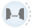
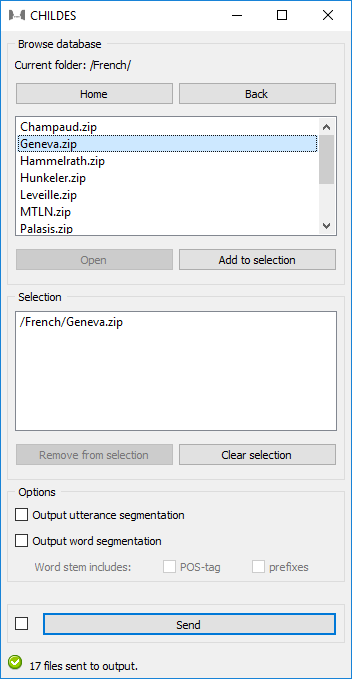

.. meta::
   :description: Orange3 Textable Prototypes documentation, CHILDES widget
   :keywords: Orange3, Textable, Prototypes, documentation, CHILDES, widget

.. _CHILDES:

CHILDES
=======

Import data in XML format from the `CHILDES
<https://childes.talkbank.org/data-xml/>`_ database.

Author
------

Aris Xanthos

Signals
-------

Inputs: None

Outputs:

* ``Files``

  Segmentation with a segment for each file in imported corpora

* ``Utterances`` (optional)

  Segmentation with a segment for each utterance in imported corpora

* ``Words`` (optional)

  Segmentation with a segment for each word in imported corpora

Description
-----------

This widget is designed to import one or more CHILDES corpora 
in Orange Canvas. The corpora are retrieved from
`<https://childes.talkbank.org/data-xml/>`_ and richly encoded in XML format. 
The widget outputs at least one segmentation containing a segment for each file 
in  each imported corpus. Segments in this segmentation have a variable number 
of annotations (depending on what is available for each corpus):[1]_

=====================      =====
key                        example value
=====================      =====
*corpus*                   *Geneva*
*file_path*                *Geneva/020107.xml*
*lang*                     *fra*
*pid*                      *11312/c-00028161-1*
*target_child_id*          *CHI*
*target_child_age*         *P2Y01M07D*
*target_child_days*        *757*
*target_child_months*      *25*
*target_child_years*       *2*
=====================      =====

Optionally, the output may also include two more segmentations, into utterances
and into words. Both inherit the annotations above. The utterance segmentation
adds two extra annotations:

==========  ===============
key              example value
==========  ===============
*uID*            *u0*
*who*            *CHI*
==========  ===============

The word segmentation inherits all previous annotations, and adds a variable 
number of annotations (depending on the information available in the data), 
namely at most: 

===========   =========
key           example value
===========   =========
*head*        *1*
*index*       *0*
*pos*         *part*
*prefixes*    *dé*
*relation*    *OBJ*
*stem*        *faire*
*suffixes*    *PP&m*
===========   =========

Interface
~~~~~~~~~

User controls are divided into three main sections (see :ref:`figure 1 
<childes_fig1>` below): **Browse database**, **Selection**, and **Options**.

.. _childes_fig1:

    Figure 1: **CHILDES** widget interface.

The **Browse database** section allows the user to navigate the XML section of
the CHILDES database (`<https://childes.talkbank.org/data-xml/>`_) and select
the desired corpora. It is organized like a file tree, starting from a root 
folder (denoted as "/"), and each folder may contain any number of subfolders
and/or zipped archives.

To view the contents of a folder, either double-click it or select it and
click **Open**. Button **Back** brings you back to the parent folder, and 
**Home** to the root folder.

**Add to selection** adds the highlighted archive(s) to your selection, and so 
does double-clicking an archive. If a folder is highlighted, clicking **Add to 
selection** results in adding *all* the archives contained in this folder and, 
recursively, in contained subfolders (so possibly a lot of archives), to your 
selection. Note that multiple archives/folders may be highlighted (using 
control/command-click or shift-click) and added at once to your selection.

When the current folder is the root folder ("/"), the **Home** button is 
replaced with **Refresh**. Clicking **Refresh** instructs the widget to connect
to the CHILDES website and update its own configuration to take into account
possible changes (usually additions) to the database. This operation may take
a few minutes and is only useful when the online database has changed; it has 
the additional consequence that it cancels previous selections.

The **Selection** section lists all corpora that are marked for import. Note
that only a single copy of any given corpora can be added to this list 
(attempting to add it twice will have no effect).

**Remove from selection** removes the highlighted archive(s) from your 
selection, and so does double-clicking an archive. Multiple archives may be 
highlighted (using control/command-click or shift-click) and removed at once 
from your selection. **Clear selection** removes *all* archives from your 
selection.

The **Options** section enables the user to select whether optional 
segmentations (utterances and words) should be extracted and sent in output. It 
also offers two options for fine-tuning the word extraction process: ticking 
**Words stem includes: POS-tag** prepends a word's *stem* annotation with its 
part-of-speech tag, which can be useful to separate homophonous stems such
as *v|walk* and *n|walk*; **Words stem includes: prefixes** prepends stems
with prefixes, if any, which is necessary if you want to treat e.g. *write*
and *re#write* as separate stems.

The **Info** section informs the user about the status of the widget and 
indicates the number of segments and characters in the output segmentation, or 
the reasons why no segmentation is emitted (no corpus selected, connection 
issues, etc.).

The **Send** button triggers the retrieval and emission of one or more 
segmentations to the output connection(s). When it is selected, the **Send 
automatically** checkbox disables the button and the widget attempts to 
automatically emit a segmentation at every modification of its interface.

Caveat about word extraction
~~~~~~~~~~~~~~~~~~~~~~~~~~~~

Extracting a word segmentation based on CHILDES XML has proved a challenging
task and should be considered a beta feature at this point in the development of
the widget. The extraction strategy that has been implemented is based on the
author's perception of the most important features of the `CHILDES XML schema
<https://talkbank.org/software/xsddoc/>`_ and has only be tested thus far on a
limited fraction of the CHILDES corpora. This strategy can be summarized as 
follows:

#. substitute replacements (if any) for words, e.g. *lemme [: let me]*
#. move *<gra>* elements inside adjacent non-compound words (*<mc>*)
#. extract all words (*<w>*)
#. for each non-compound word (*<mw>*) in each word:

   #. create a new word segment
   #. extract this non-compound word's attributes and assign them as annotations to the new word segment
 

Messages
--------

Information
~~~~~~~~~~~

*<n> files, <m> utterances and <l> words sent to output.*
    This confirms that the widget has operated properly.

Warnings
~~~~~~~~

*Settings were changed, please click 'Send' when ready.*
    Settings have changed but the **Send automatically** checkbox
    has not been selected, so the user is prompted to click the **Send**
    button (or equivalently check the box) in order for computation and data
    emission to proceed.

*Please add a corpus to the selection.*
    The widget instance is not able to emit data to output because no corpus
    has been added to the selection.

*Connecting to CHILDES website, please wait...*
    The widget instance is in the process of connecting with the CHILDES website
    in order to recreate the database cache.

Errors
~~~~~~

*Couldn't download corpus %s from CHILDES website.*
    An error has prevented the widget from downloading the indicated corpus
    from the CHILDES website.

*Error while attempting to scrape the CHILDES website.*
    An error has prevented the widget to scrape the data from the
    CHILDES website while recreating the database cache.

*Couldn't save database to disk.*
    An error has prevented the widget from saving the database cache to disk 
    after recreating the database cache.
    

.. [1] The user is reffered to the `CHAT transcription format documentation <https://talkbank.org/manuals/CHAT.html>`_ for the meaning and possible values of the numerous annotations extracted by the widget.
