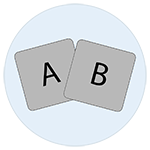
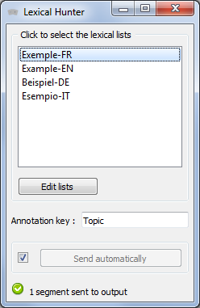
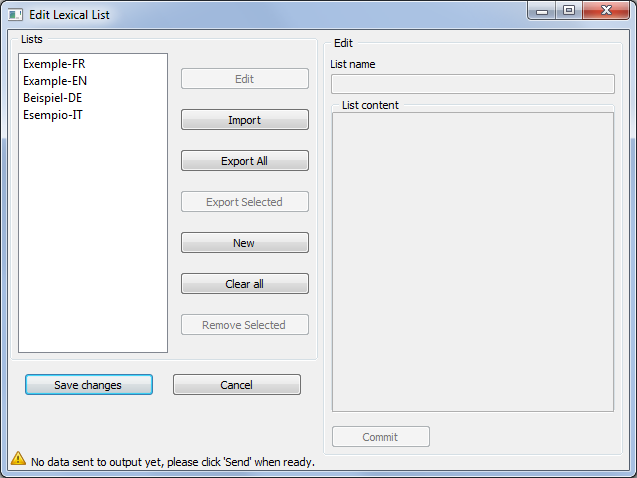

.. meta::
   :description: Orange3 Textable Prototypes documentation, LexicalHunter 
                 widget
   :keywords: Orange3, Textable, Prototypes, documentation, LexicalHunter,
              widget

.. _LexicalHunter:

LexicalHunter
=================

Annotates a segmentation based on one or more lexical fields.

Authors
------

* Maxime Bony
* Simon Cappelle
* Robin Pitteloud

Signals
-------

Inputs: 
* ``Text segmentation``

Outputs:

* ``Text segmentation``

  Segmentation with annotations

Description
-----------

This widget is a lexical fields identifier.
It creates annotation based on one or multiple lexical fields. 
There are some basic lexical fields, but the user can modify or remove them. 
The user can also create and/or import custom lexical fields. 
t is possible to export these lexical fields as well.
The interface of LexicalHunter is available in two versions, a basic one that lets the user select some 
lexical fields to annotate the segmented data and an advanced one that lets the user manage these lexical lists.

Basic interface
~~~~~~~~~~~~~~~

In its basic version (see :ref:`figure 1 <lexicalhunter_fig1>` below), the
**LexicalHunter** widget simply lets the user select one or more lexical fields
in the default list. To select multiple files use either control/command-click 
or shift-click.

.. _lexicalhunter_fig1:

    Figure 1: **LexicalHunter** widget (basic interface).

The **Annotation key** section allows the user to define the name of the 
annotation key.

The **Info** section indicates the number of segments in the output segmentation, or the reasons why no segmentation is emitted (segmentation 
input is needed, please select one or more lexical lists, etc.).

The **Send** button triggers the emission of a segmentation to the output
connection(s). When it is selected, the **Send automatically** checkbox
disables the button and the widget attempts to automatically emit a
segmentation at every modification of its interface.

Advanced interface
~~~~~~~~~~~~~~~~~~

The advanced version of **LexicalHunter**  (see :ref:`figure 2 
<lexicalhunter_fig2>` below) lets the user edit, delete, add, import 
or export lists.

.. _lexicalhunter_fig2:

    
    Figure 2: **LexicalHunter** widget (advanced interface).
    
    
The **Edit** button puts the content of the selected list in the text 
field.

The **Import** button allows the user to import a list from a .txt file.

The **Export all** button allows the user to export every lexical field 
from the list. They are saved as .txt files.

The **Export selected** button allows the user to export the selected 
lexical field.

The **New** button allows the user to create a new lexical field.

The **Clear all** button allows the user to delete all of the lexical lists.

The **Remove selected** button allows the user to delete the selected 
lexical list.

The **Commit** button saves the changes made to the list that is in the 
text field.

The **Save changes** button saves all the changes made by the user to the lists.

The **Cancel button** cancels all the changes made by the user to the lists.

Messages
--------

Information
~~~~~~~~~~~

*<n> segments sent to output.*
    This confirms that the widget has operated properly.

Warnings
~~~~~~~~

*A segmentation input is needed.*
    The widget needs an input segmentation to process data.
    
*An annoatation key is needed.*
    The widget needs an annotation key value.

*Settings were changed, please click 'Send' when ready.*
    Settings have changed but the **Send automatically** checkbox
    has not been selected, so the user is prompted to click the **Send**
    button (or equivalently check the box) in order for computation and data
    emission to proceed.

*Please select one or more lexical lists.*
    The widget instance is not able to emit data to output because no lexical
    list has been selected.

*No data sent to output yet: no input segmentation.*
    The widget instance is not able to emit data to output because it receives
    none on its input channel(s).

Errors
~~~~~~
*You need to define at least one lexical list*
    The user needs to define at least one lexical list.