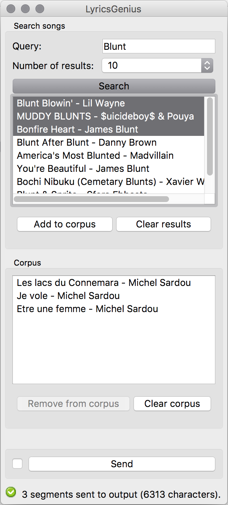

3.. meta::
   :description: Orange3 Textable Prototypes documentation, LyricsGenius
                 widget
   :keywords: Orange3, Textable, Prototypes, documentation, LyricsGenius,
              widget

.. _Topic Models:

LyricsGenius
============

Make a corpus with songs lyrics.

Author
------

Cyrille Gay-Crosier, Rafael Bruni Baschino, Basile Maillard

Signals
-------

Input: None

Outputs:

* ``Text data``

    A segmentation with the lyrics of the selected songs.

Description
-----------

This widget is designed to import one or more songs lyrics in Orange Canvas.
The lyrics are retrieved from `<https://genius.com/>`_. The output is a
segmentation containing a segment for each imported songs.
Each segment has 4 annotations with keys *artist*,
*artist_id*, *path*, *title*.

Interface
~~~~~~~~~

The **LyricsGenius** widget simply lets the user make a search on the
`Genius <https://genius.com/>`_ website.

.. _LyricsGenius_fig1:

    Figure 1: **LyricsGenius** widget interface.

The **Create my corpus** section allows the user to add or remove songs from
the search results.

The **My titles** section is the user "Corb". He can add or remove songs form
his corpus with the section **Create my corpus**.

The **Send** button triggers the emission of a segmentation to the output
connection(s). When it is selected, the **Send automatically** checkbox
disables the button and the widget attempts to automatically emit a
segmentation at every modification of its interface.

Messages
--------

Information
~~~~~~~~~~~

*<n> segments sent to output (<m> characters).*
    This confirms that the widget has operated properly.

Warnings
~~~~~~~~

*Settings were changed, please click 'Send' when ready.*
    Settings have changed but the **Send automatically** checkbox
    has not been selected, so the user is prompted to click the **Send**
    button (or equivalently check the box) in order for computation and data
    emission to proceed.

*You didn't search anything*
    The user want to make a search with no text in the query box.

*Your corpus is empty, please add some songs first*
    The corpus is empty, so the user have to add some songs before sending.

Errors
~~~~~~

*Couldn't download data from Genius website.*
    An error has prevented the widget to download the data from the
    Genius website (most likely related to a connection problem).
