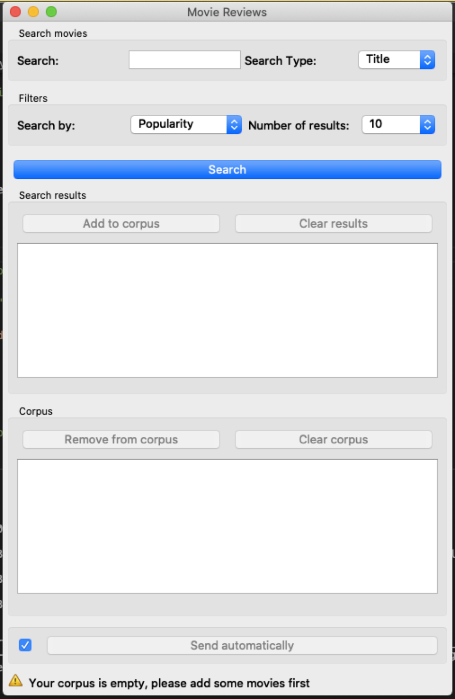

Movie Reviews
=================

Retrieving the IMDB movie reviews 

Authors
-------
Caroline Roxana Rohrbach, Maryam Zoee, Victor Vermot-Petit-Outhenin

Signals
-------
Input: None

Outputs:

* ``Text data``

    A segmentation with the reviews of the selected movies.

Description
-----------

This widget is designed for searching any movie by its title and the output is 25 reviews of the film. 
The widget will use imdb library to import the movies’ data.

Interface
~~~~~~~~~

Figure 1: **Movie Reviews** widget interface

The **Movie Reviews** widget lets the user make a search on the IMDB library.

The **Search** button searches the database for entries matching user's input.

The **Corpus** section is a container where the user's movie selections are stored. The user can add or remove the movies to and from their corpus or clear the corpus entirely.

The **Send** button triggers the emission of a segmentation to the output connection(s). When selected, the Send automatically checkbox disables the button and the widget attempts to automatically emit a segmentation at every modification of its interface.

Messages
--------

Information
~~~~~~~~~~~

*<n> segments sent to output (<m> characters).*
    This confirms that the widget has operated properly.

Warnings
~~~~~~~~

*Please enter a movie title*
    The user attempted to make a search with no text in the query box.

*Your corpus is empty, please add some movies first*
    The corpus is empty, no movies have been selected for downloading the reviews.

Errors
~~~~~~

*Couldn't download data from imdb*
    An error has prevented the widget from downloading the data from the imdb website (probably because of a connection problem).

