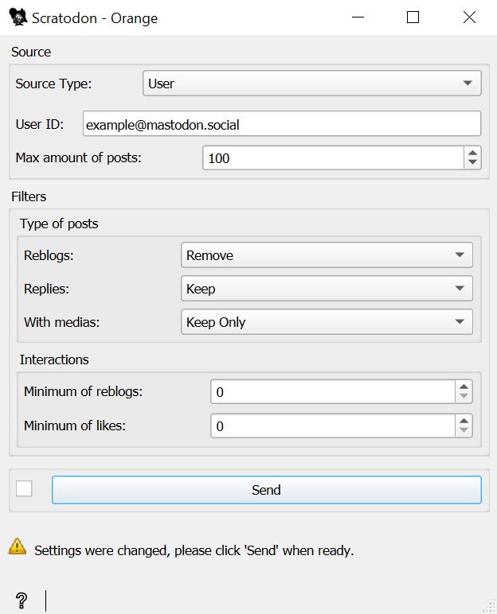

.. meta::
   :description: Orange3 Textable Prototypes documentation, Scratodon
                 widget
   :keywords: Orange3, Textable, Prototypes, documentation, Scratodon,
              widget

.. _Scratodon:

Scratodon
=========

.. image:: figures/scratodon_logo_doc.png

Web scraping of the social media mastodon 

Author
------

Marly Rose, Savits Dimitra, Demierre Laure, Renteria Samuel, Oppliger Olivier

Signals
-------

Input: None

Outputs:

``Segmentation``

   Annoted segments for each scraped posts from an instance of Mastodon

Description
-----------

This widget is for the purpose of scrapping posts from instances of the social media *Mastodon*
(for example: https://rivals.space/explore).
The name comes from the combination of scraping and mastodon, but adapted to the fictional character
of *Scrat* from *Ice Age* (Wedge & Saldanha, 2002).
Each post will be send as a segment, including annotations for specific informations.
It can be information about: *account*, *URL*, *reply*, *reblog* (known also as *repost*)
and the amount of them, *case sensitive*, *media*, *visibility* and *like*.

Interface
~~~~~~~~~

    Figure 1: **Scratodon** widget interface.

The **Scratodon** widget lets the user the possibility to scrap data from
the social media Mastodon, coming from an user, a federated or a local instance.

The **Source** roll down button allows to choose the type of source the user wants to use.
It can be the following choices: **User**, **Federated** or **Local**.
Depending of the choice, it will require either an **User ID** (for **User**) or an **URL** (for the two other choices).
**User ID** is under the format of *(@)user@instance* or an entire user URL like *https://www.instance.fr/@user*.
**URL** format is *thisis.anexample* or an entire URL like *https://www.instance.something*.
A default value is in the widget by default for a base example.

The **Max amount of posts** counter lets the user to choose how many posts will be scraped.
Warning: this is the amount of posts scraped and **not** the amount of posts received as segments at the end of the process.

The **Exclude reblogs** and the **Exclude replies** button will delete all posts including a reblog/reply situation.

The **API key** field is present if an user needs specific authorisation to gain access to the datas,
such as with a private account.

The **Reblogs only** button will only send back posts who's been at least reposted once.

The **Minimum of reblogs** and **Minimum of likes** counter allows to chose how many reblogs/likes a post needs to have.

The **Exclude images** button will only return posts without media linked to it.
In opposite, the **Only images** button allows only posts containing a media with them.

The **Send** button is used to send data (the segments with their annotations) to output.

Messages
--------

Information
~~~~~~~~~~~

*Succesfully scrapped ! X segments sent to output*
    This confirms that the widget has operated properly.

Warnings
~~~~~~~~

*Please give a User ID.*
    The user didn't give an user ID to retrieve posts.
    
*Please give a URL.*
    The user didn't give an URL to retrieve posts.
