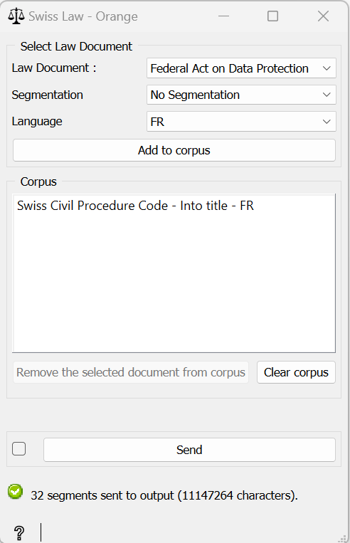

.. meta::
   :description: Orange3 Textable Prototypes documentation, Swiss Law
                 widget
   :keywords: Orange3, Textable, Prototypes, documentation, Swiss, Law,
              widget

.. _SwissLaw:

Swiss Law
=============

.. image:: figures/SwissLaw.png

Make a corpus with Swiss law documents.

Author
------

Antoine Vigand, Elijah Green, Samantha Allendes et Thomas Rywalski

Signals
-------

Input: None

Outputs:

* ``Text data``

    The selected Swiss law documents with the requested segmentation.

Description
-----------

Create a widget for Orange Textable (v3.7) to import the main Swiss legal texts from
XML file from the site `fedlex.admin.ch <https://www.fedlex.admin.ch/fr/home?news_period=last_day&news_pageNb=1&news_order=
desc&news_itemsPerPage=10>`_. SwissLaw is a widget included in Orange3-Textable-Prototypes, a tool developed with
Orange 3 software using the Python language.

Interface
~~~~~~~~~

.. _SwissLaw3_fig1:

    Figure 1: **Swiss Law** widget interface.

The **Swiss Law** widget simply lets the user make a search on the
https://www.fedlex.admin.ch/ website from a list of the 20 most consulted legal documents.

The **Select Law Document** section allows the user to choose a law document, a segmentation and a language.

The **Corpus** section allows the user to clear or remove selected document from
the corpus.

The **Send** button triggers the emission of a segmentation to the output
connection(s). When selected, the **Send automatically** checkbox
disables the button and the widget attempts to automatically emit a
segmentation at every modification of its interface.

Messages
--------

Information
~~~~~~~~~~~

*<n> segments sent to output (<m> characters).*
    This confirms that the widget has operated properly.

Warnings
~~~~~~~~

*Settings were changed, please click 'Send' when ready.*
    Settings have changed but the **Send automatically** checkbox
    has not been selected, so the user is prompted to click the **Send**
    button (or equivalently check the box) in order for computation and data
    emission to proceed.

*Your corpus is empty, please add some law texts first.*
    The corpus is empty, so the user have to add some law documents before sending.
