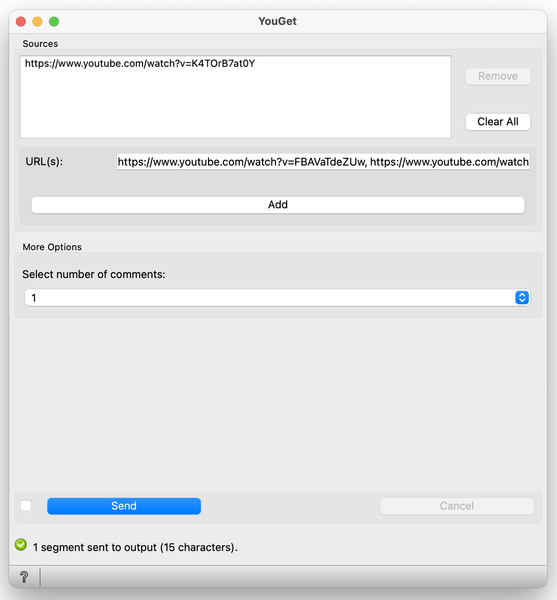

.. meta::
   :description: Orange3 Textable Prototypes documentation, YouGet widget
   :keywords: Orange3, Textable, Prototypes, documentation, YouGet, widget

.. _YouGet:

YouGet
=======

Import YouTube video comments (`<https://www.youtube.com>`_).

Author
------

Virgile Albasini, Sophie Ward, Lorelei Chevroulet, and Vincent Joris.

Signals
-------

Inputs: 

* Enter a YouTube video's URL to download comments
* Import a URL list
* Choose the amount of comments you would like to download (minimum 1 comment, 10, 100, 1000, 10'000 or no limit)

Outputs:

* The comments from a YouTube video in the form of a segmentation

Optional 

* Have the comments in output ordered by likes or by their date

Description
-----------

This widget provides a graphical interface which is designed to allow the user to enter a YouTube video's URL and
download its comments (`<https://www.youtube.com>`_).
The output is a segmentation containing the **Number of Comments** desired from the chosen YouTube video.

* Choose one or more URL(s) and place them in the **URL(s)** section in the following format: URL1, URL2, URL3, etc.
* **Add** them to the **Sources** section
* Choose the **Number of Comments** you would like to download from the YouTube video
* Press **Send** to see the comments in the form of a segmentation

Interface
~~~~~~~~~~~~~~~

User controls are divided into two main sections: **Sources**, which holds the **URL** subsection, and **Options**.

.. _YouGet_principal:

    Figure 1: **YouGet** widget interface.

Sources
*******

The **Sources** section contains all the controls related to the way **YouGet** processes the input data. 

The user chooses one ore more YouTube videos which they would like to extract its comments. Once the desired number of videos chosen, the user
adds the URL(s) into the empty **URL(s)** section. To confirm their URL(s), they must press on the **Add** button which
will add their URL(s) to a list in the section above called **Sources**. The user can add one or more URLs to their list in **Sources**.
If they wish to remove a URL, they can press on the **Remove** button. If they wish to not only remove one, 
but all of their URLs, they can press on the **Clear All** button.

Options
*******

The **Options** section contains the controls to choose the **Number of Comments** desired in output. The user can choose between having **1 comment (minimum requirement), 10, 100, 1000, 10'000 or no limit** 
of comments in output. Once the user presses on the **Send** button, the comments will then be displayed in output in the form 
of a segmentation.

.. figure:: figures/YouGet_1comment.png
    :align: center
    :alt: Interface of the YouGet widget
.. figure:: figures/YouGet_10comment.png
    :align: center
    :alt: Interface of the YouGet widget

Messages
--------

Information
~~~~~~~~~~~

*f"{len(processed_data)} segment@p sent to output"*
   This confirms that the widget has operated correctly and that the segments have been sent to output.

Warnings
~~~~~~~~

*Please add a YouTube URL*
   The URL section is empty, so the user has to add at least one URL before sending.

*Settings were changed, please click 'Send' when ready.*
   Settings have changed but the **Send automatically** checkbox has not been selected, 
   so the user is prompted to click the **Send** button (or equivalently check the box) 
   in order for computation and data emission to proceed.

*Step 1/2: Processing...*
   The requested analysis is being performed.

Errors
~~~~~~~~

*Duplicate URL(s) found and deleted.*
   The system finds one or multiple duplicate URL(s) and deletes them instead of adding them.

*One or more elements are not YouTube URLs, please only add YouTube URLs.*
   If there are multiple elements added in the **URL(s)** section and one of them is not an URL, then all of these elements will not be added to the **Sources** section.

*Please check your internet connection*
   If the internet connection is interrupted during the process of adding URLs to the **Sources** section or during the loading process of the comments, there will be an error message that will appear to please check your internet connection.

*Please make sure that input is well-formed XML*
   The URL section must only contain URLs.

Note
~~~~~~~~

Note that when starting the widget and when you add one or more URL(s) in the **URL(s)** section, the **Add** button is gray but is functional. You need to press on the **Add** button to add your URL(s) to the **Sources** section.

If there is a break in WIFI connection, please press cancel and start again.
