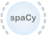

.. meta::
   :description: Orange3 Textable Prototypes documentation, spaCy widget
   :keywords: Orange3, Textable, Prototypes, documentation, spaCy, widget

.. _spaCy:

spaCy
=======

Natural language processing using the spaCy (`<https://spacy.io/>`_) library.

Author
------

Aris Xanthos

Signals
-------

Inputs: ``Text data``

  Textable segmentation

Outputs:

* ``Tokenized text`` (default)

  Segmentation with a segment for each `token <https://spacy.io/usage/spacy-101#annotations-token>`_ in the input data

* ``Named entities`` (optional)

  Segmentation with a segment for each `named entity <https://spacy.io/usage/linguistic-features#named-entities>`_ in the input 
  data

* ``Noun chunks`` (optional)

  Segmentation with a segment for each `noun chunk <https://spacy.io/usage/linguistic-features#noun-chunks>`_ in the input data

* ``Sentences`` (optional)

  Segmentation with a segment for each `sentence <https://spacy.io/usage/linguistic-features#sbd>`_ in the input data

Description
-----------

This widget provides a graphical interface to a number of functionalities of 
the spaCy (`<https://spacy.io/>`_) natural language processing Python library:

* tokenization
* part-of-speech tagging
* lemmatization
* named entity recognition
* noun chunk segmentation
* sentence segmentation

The user is referred to the extensive documentation of spaCy for detailed
explanations of what these various levels of linguistic analysis encompass and
how they are technically obtained. Note that spaCy is able to process text in a
range of languages (cf. `<https://spacy.io/usage/models#languages>`_), provided
that the corresponding language "models" have been downloaded by the user, a 
task that this widget can do for you.

The widget outputs at least one segmentation containing a segment for each 
token in the input data. Segments in this segmentation have a variable number 
of annotations (depending on user-defined parameters and what is available for
the language in question). For example, here is what spaCy's *en_core_web_sm*
model returns for token *library* in the sentence *This library rocks.* (see spaCy's `documentation <https://spacy.io/api/token#attributes>`_ for details):

================    =============
key                 example value 
================    =============
*dep_*              *nsubj*
*ent_iob_*          *O*
*head*              *rocks*
*is_alpha*          *True*
*is_bracket*        *False*
*is_digit*          *False*
*is_left_punct*     *False*
*is_lower*          *True*
*is_oov*            *True*
*is_punct*          *False*
*is_quote*          *False*
*is_right_punct*    *False*
*is_space*          *False*
*is_stop*           *False*
*is_title*          *False*
*is_upper*          *False*
*lang_*             *en*
*lemma_*            *library*
*like_email*        *False*
*like_num*          *False*
*like_url*          *False*
*lower_*            *library*
*norm_*             *library*
*pos_*              *NOUN*
*sentiment*         *0.0*
*shape_*            *xxxx*
*tag_*              *NN*
*whitespace_*       *" "*
================    =============

Optionally, the widget's output may also include up to three more 
segmentations, into `named entities 
<https://spacy.io/usage/linguistic-features#named-entities>`_, noun chunks 
<https://spacy.io/usage/linguistic-features#noun-chunks>`_, and `sentences 
<https://spacy.io/usage/linguistic-features#sbd>`_. These elements have the 
annotations *lemma_*, *lower_* and *sentiment*, as well as *label* (for all but
sentences).

Interface
~~~~~~~~~

User controls are divided into two tabs: (see :ref:`figure 1 
<spacy_fig1>` below): **Options** and **Model manager**.

.. _spacy_fig1:

.. figure:: figures/spacy_interface_options.png
    :align: center
    :alt: Interface of the spaCy widget, Options tab

    Figure 1: **spaCy** widget interface, **Options** tab.

Options tab
***********

The **Options** tab contains all controls related to the way spaCy processes
the input data. 

The **Model** dropdown menu lets the user specify the language
model to be used, among those that have been installed on their computer (see
below for how to download and install models using the **Model manager** tab). 

Regardless of any configuration choices, a given language model will at least
output a tokenized version of the input data, with a subset of the annotations 
indicated above. By ticking boxes in the **Additional token annotations** 
section, the user can opt to add information concerning **part-of-speech 
tags**, **syntactic dependencies**, and **named entities**. Note that ticking
these boxes may require to reload the language model (which can take some time, 
depending on model size), and will increase the duration of processing (in proportion of the amount of input data).

When boxes in the **Additional segmentations** are ticked, the widget will 
send up to three additional segmentations on separate output channels (which
can be accessed by double-clicking the connexions between the **spaCy** widget 
and the next widget in the line and redrawing the connexions as desired in the
**Edit Links** dialog). The segments of these segmentations correspond to 
**named entities**, **noun chunks**, and **sentences** respectively. The same 
remarks as for additional annotations apply: ticking these boxes may require to reload the language mode and will increase the duration of processing.

The last item in the **Options** section controls the **maximum number of input
characters** allowed by the widget. As indicated in spaCy's documentation, the
spaCy parser and NER models require roughly 1GB of temporary memory per 100'000
characters in the input; this means long texts may cause memory allocation
errors. It is probably safe to increase the default limit of 1 million 
characters if you're not using the syntactic parser (required for syntactic 
dependency annotation as well as noun chunk and sentence segmentation) or 
named entity recognizer, or have a large amount of RAM available.

Model manager tab
*****************

The **spaCy** widget is initially installed without language models. 
The **Model manager** tab (see :ref:`figure 2 <spacy_fig2>` below) enables the
user to download and install additional language models for English or for 
other languages (cf. `<https://spacy.io/usage/models#languages>`_ for available
language models)

.. _spacy_fig2:

.. figure:: figures/spacy_interface_model_manager.png
    :align: center
    :alt: Interface of the spaCy widget, Model manager tab

    Figure 2: **spaCy** widget interface, **Model Manager** tab.

Simply select one ore more models to download and install, then click
**Download** and confirm your choices with **OK**. After the models have been 
downloaded and installed, you will be prompted to quit and restart Orange
Canvas for changes to take effect. Please note that some models may be quite 
large and take a substantial amount of time to download.

Messages
--------

Information
~~~~~~~~~~~

*<n> tokens, <m> noun chunks, <l> entities and <k> sentences sent to output.*
    This confirms that the widget has operated properly.

Warnings
~~~~~~~~

*Settings were changed, please click 'Send' when ready.*
    Settings have changed but the **Send automatically** checkbox
    has not been selected, so the user is prompted to click the **Send**
    button (or equivalently check the box) in order for computation and data
    emission to proceed.

*Widget needs input.*
    The widget instance needs data to be sent to its input channel in order
    to process it.

*Please download a language model first.*
    At least one language model needs to be installed before the widget can
    operate.

*Loading language model, please wait...*
    A language model is currently being downloaded and installed.

*Processing, please wait...*
    The requested NLP analysis is being performed.

*Input exceeds max number of characters set by user.*
    The number of characters in the widget's input is larger than the maximum
    number of characters allowed based user-defined settings; either decrease
