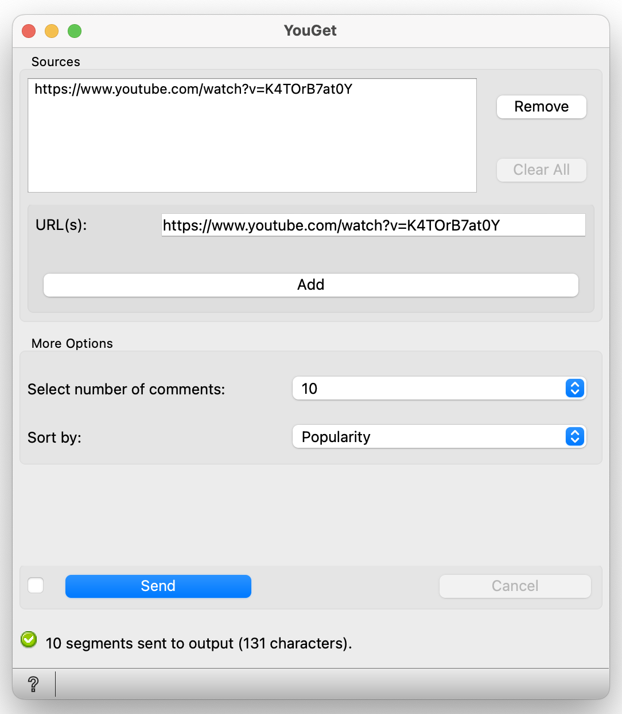

.. meta::
   :description: Orange3 Textable Prototypes documentation, YouGet widget
   :keywords: Orange3, Textable, Prototypes, documentation, YouGet, widget

.. _YouGet:

YouGet
=======

.. image:: figures/YouGet.svg

Import YouTube video comments (`<https://www.youtube.com>`_).

Author
------

Virgile Albasini, Sophie Ward, Lorelei Chevroulet, et Vincent Joris

Signals
-------

Inputs: 

* Enter a YouTube video's URL to download comments
* Import a URL list
* Choose the amount of comments you would like to download (minimum 1 comment, then 100, then 1000, or no limit)

Outputs:

* The comments from a YouTube video in the form of a segmentation

Optional 

* Have the comments in output ordered by likes or by their date

Description
-----------

This widget provides a graphical interface which permits the user to enter an YouTube video's URL and
download its comments (`<https://www.youtube.com>`_).
The output is a segmentation containing the comments of the chosen YouTube video. 

* Choose an URL
* Choose the number of comments you would like to download
* See the comments in the form of a segmentation

**YouGet**'s interface is available in two versions, depending on whether or not the Advanced Settings is
selected.

Basic Interface
~~~~~~~~~~~~~~~

In its basic version, user controls are divided into two sections: **Sources** and **Options**.

.. _YouGet_principal:

    Figure 1: **YouGet** widget interface.

Sources
*******

The **Sources** section contains all the controls related to the way YouGet
processes the input data. 

The user adds the YouTube video's URL of their choice in the **URL**'s section and presses
on the **Add** button to add their URL to the list. The user can add one or more URLs to their list which will then appear
in the empty section above. If they wish to remove an URL, they can press on the **Remove** 
button. If they wish to not only remove one, but all of their URLs, they can press on the 
**Clear All** button.

Options
*******

The **Options** section contains the controls to choose how many comments is desired in output.

The user can choose the **number of comments** they would like have in output. They can choose between 
having 1 comment (minimum requirement), 100, 1000, or an illimited amount of comments in output.

Once the user presses on the **Send** button, the comments will then be displayed in output in the form 
of a segmentation.

Advanced Interface
~~~~~~~~~~~~~~~~~~
In its advanced version, **YouGet** offers the same functionnalities as the basic one, but adds the 
possibility of filtering the YouTube comments according to their number of **likes** or by their
**date of publication**.

Messages
--------

Information
~~~~~~~~~~~

to be added

Warnings
~~~~~~~~

to be added

Errors
~~~~~~~~

to be added

Note
~~~~~~~~

to be added if notes needed
