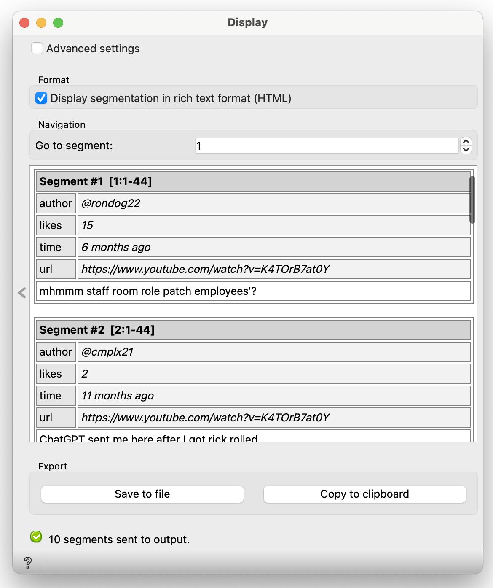

.. meta::
   :description: Orange3 Textable Prototypes documentation, YouGet widget
   :keywords: Orange3, Textable, Prototypes, documentation, YouGet, widget

.. _YouGet:

YouGet
=======

.. image:: figures/YouGet.svg

Import YouTube video comments (`<https://www.youtube.com>`_).

Author
------

Virgile Albasini, Sophie Ward, Lorelei Chevroulet, and Vincent Joris.

Signals
-------

Inputs: 

* None

Outputs:

* The comments from a YouTube video in the form of a segmentation

Description
-----------

This widget provides a graphical interface which is designed to allow the user to enter a YouTube video's URL and
download its comments (`<https://www.youtube.com>`_).
The output is a segmentation containing the **Number of Comments** desired from the chosen YouTube video.

* Choose one or more URL(s) and place them in the **URL(s)** section in the following format: URL1, URL2, URL3, etc.
* **Add** them to the **Sources** section
* Choose the **Number of Comments** you would like to download from the YouTube video
* Press **Send** to see the comments in the form of a segmentation

Interface
~~~~~~~~~~~~~~~

User controls are divided into two main sections: **Sources**, which holds the **URL** subsection, and **Options**.

.. _YouGet_principal:

.. figure:: figures/YouGet_principal.png
    :align: center
    :alt: Interface of the YouGet widget
    :height: 600px

    Figure 1: **YouGet** widget interface.

Sources
*******

The **Sources** section contains all the controls related to the way **YouGet** processes the input data. 

The user chooses one ore more YouTube videos which they would like to extract its comments. Once the desired number of videos chosen, the user
adds the URL(s) into the empty **URL(s)** section. To confirm their URL(s), they must press on the **Add** button which
will add their URL(s) to a list in the section above called **Sources**. The user can add one or more URLs to their list in **Sources**.
If they wish to remove a URL, they can press on the **Remove** button. If they wish to not only remove one, 
but all of their URLs, they can press on the **Clear All** button.

Options
*******

The **Options** section contains the controls to choose the **Number of Comments** desired in output. The user can choose between having **1 comment (minimum requirement), 10, 100, 1000, 10'000 or no limit** 
of comments in output. Once the user presses on the **Send** button, the comments will then be displayed in output in the form 
of a segmentation.

.. figure:: figures/YouGet_1comment.png
    :align: center
    :alt: Interface of the YouGet widget
    :height: 400px

Messages
--------

Information
~~~~~~~~~~~

*f"{len(processed_data)} segment@p sent to output"*
   This confirms that the widget has operated correctly and that the segments have been sent to output.

Warnings
~~~~~~~~

*Settings were changed, please click 'Send' when ready.*
   Settings have changed but the **Send automatically** checkbox has not been selected, 
   so the user is prompted to click the **Send** button (or equivalently check the box) 
   in order for computation and data emission to proceed.

*Step 1/2: Processing...*
   The requested analysis is being performed.

Errors
~~~~~~~~

*(nb) duplicate URL(s) found and deleted*
   The system finds one or multiple duplicate URL(s) and deletes them instead of adding them.

*(nb) URL(s) are not valid YouTube videos*
   The widget detects that the URL(s) are misspelt and does not add them to the list.

*One or more elements are not YouTube URLs or please check your internet connection*
   The widget detetcs that there is an error with the process. Either in terms of the URL(s) themselves or with the internet connection. If there are multiple elements added in the **URL(s)** section and one of them is not an URL, then all of these elements will not be added to the **Sources** section. If the internet connection is interrupted during the process of adding URLs to the **Sources** section or during the loading process of the comments, there will be an error message that will appear to please check your internet connection.

Note
~~~~~~~~

Note that when starting the widget and when first adding your URL(s), the **Add** button is gray, however, it is functional. Press the **Add** button to add your URL(s) to the **Sources** section.

Note also that in the **Select number of comments** section, there is a 1 there by default, but it does not do anything. If you do not choose
a number of comments, the output will be 7 by default. If you
wish to only have 1, even though it is written at the beginning 1, you must make sure to click yourself on the number 1. If you wish more comments, you must click on the other options.
