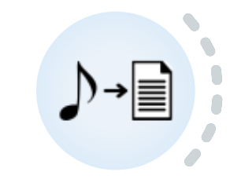

.. meta::
   :description: Orange3 Textable Prototypes documentation, Audio File
                 widget
   :keywords: Orange3, Textable, Prototypes, documentation, Audio, File,
              widget

.. _Audio File:

Audio File
=============

Transcribe an audio file into text and segment it depending on volume parameters. 

Author
------

* Gavin Vinasi
* Johan Cuda
* Rebecca Kneubuehler

Signals
-------

Input : None

Outputs :

* ``Text data``

    A segmentation of the transcripted audio.

Description
-----------

This widget is designed to import one audio file, wether it is an mp3 file or a wav file, and to transcribe it into a single segmentation, or multiple segments depending on volumes parameters, in Orange Canvas. 
The user can transcript any audio file, and the output is a segmentation. Each segment has one annotation with the key *title*. 

Basic interface
~~~~~~~~~

In this basic interface (see :ref:"figure 1 <audioFile_fig1>" below), the **Audio File** widget simply lets the user import an audio file and transcript it into a segmentation. The user must also pick the corresponding language. 

.. _audioFile_fig1:

    Figure 1: **Audio file** widget (basic interface).

The **File path** section lets the user choose the path of the audio file he/she wants to transcribe. 

The **Input language** section lets the user choose the language of the corresponding audio file. The default value is french. 

The **Send** button lets the user send the desired output into a segmentation. The **Send automatically** checkbox disables the button and the widget attempt to <utomatically emit a segmentation at every modification of its interface. 

The **Advanced settings** lets the user add different settings to sharpen the desired segmentation and extends the basic interface to the advanced interface. 

Advanced interface
~~~~~~~~~~~~~~~~~~

The advanced version of **Audio file**  (see :ref:"figure 2 
<audioFile_fig2>" below) lets the user refine the settings of the desired segmentation by modifying volumes parameters. 

.. _audioFile_fig2:

    
    Figure 2: **Audio file** widget (advanced interface).
    

The **Maximum volume (in dBFS)** lets the user pick the maximum level of volume that will be significant to make a segment. 

The **Minimum duration (in milliseconds)** lets the user pick the minimum duration during which the **Maximum volume** needs to last. Those two parameters combined, the user can refine how the segmentation is being segmented.  

The **Segment the audio file with the parameters** checkbox allows the user to get segments depending on those precise parameters. 

Messages
--------

Information
~~~~~~~~~~~

*Successfully transcripted*
    This confirms that the widget has operated properly and that the segmentation has been sent to ouput, in the case of no advanced settings chosen. 

*<n> segments sent to output (<m> characters)*
    This confirms that the widget has operated properly and that the segments have been sent to ouput, in the case of when the user wants to segment depending on the advanced settings. 

Warnings
~~~~~~~~

*Settings were changed, please click "Send" when ready* 
    Settings have changed but the **Send automatically** checkbox
    has not been selected, so the user is prompted to click the **Send**
    button (or equivalently check the box) in order for computation and data
    emission to proceed.

Errors
~~~~~~

*Please select input file*
    The user want to start the process of the transcription without selecting the audio file. 
    
Note
~~~~
None for now. 
