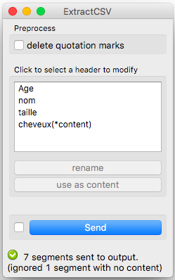

.. meta::
   :description: Orange3 Textable Prototypes documentation, Extract CSV
                 widget
   :keywords: Orange3, Textable, Prototypes, documentation, Extract CSV,
              widget

.. _ExtractCSV:

Extract CSV
=================

.. image:: figures/extractCSV_icon.pgn

Extract tabulated data as a Textable Segmentation

Author
------

Sorcha Walsh, Noémie Carette, Saara Jones

Signals
-------

Inputs: Tabulated data

Outputs:

* ``Text data``

  Segmentation of tabulated data

Description
-----------

This widget is designed to extract tabulated data as a Textable Segmentation in Orange Canvas.
It takes .csv files as input and the user can choose which header he wants to use as content. The output is a segmentation containing a segment for each line of the file and each segment has annotations with each column's header as keys.

Interface
~~~~~~~~~~~~~~~

Extract CSV displays a list of the file's headers and lets the user choose which one to use as content for the segmentation with the **Use as Content** button. If the file has no header it will simply display the number of the column.

.. _fig1:

    Figure 1: **Extract CSV** widget

The **Rename** button allows the user to rename the headers.

The **Info** section indicates the number of segments in the
output segmentation, or if any segment has been ignored because of a missing content.

The **Send** button triggers the emission of a segmentation to the output
connection(s). When it is selected, the **Send automatically** checkbox
disables the button and the widget attempts to automatically emit a
segmentation at every modification of its interface.

Messages
--------

Information
~~~~~~~~~~~

*<n> segments sent to output.*
    This confirms that the widget has operated properly.
*<n> segments sent to output. (Ignored <n> segments with no content)*
    Informs the user if segments were ignored.

Warnings
~~~~~~~~

*Settings were changed, please click 'Send' when ready.*
    Settings have changed but the **Send automatically** checkbox
    has not been selected, so the user is prompted to click the **Send**
    button (or equivalently check the box) in order for computation and data
    emission to proceed.

