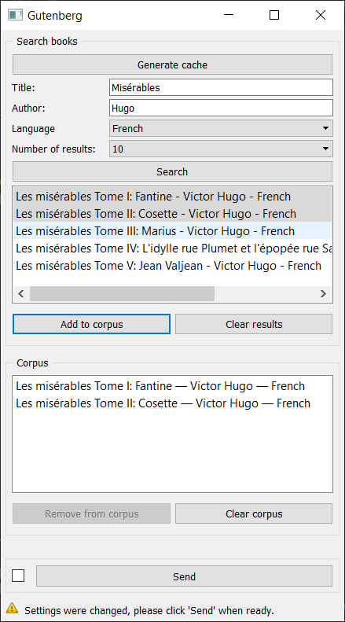

.. meta::
   :description: Orange3 Textable Prototypes documentation, Gutenberg
                 widget
   :keywords: Orange3, Textable, Prototypes, documentation, Gutenberg,
              widget

.. _Gutenberg:

Gutenberg
=============

Retrive texts from gutenberg.org 

Author
------

Florian Rieder, Paul Zignani

Signals
-------

Input: None

Outputs:

* ``Text data``

    A segmentation with the selected texts.

Description
-----------

The widget is designed to import one or more texts from `<http://www.gutenberg.org/>`_ in Orange Canvas.
The output is a segmentation containing a segment for each imported text.

Interface
~~~~~~~~~

.. _Gutenberg_fig1:

    Figure 1: **Gutenberg** widget interface.

The **Gutenberg** widget lets the user generate the databae cache of the 
`Gutenberg <http://www.gutenberg.org/>`_ website, and search it.

The **Generate Cache** button allows the user to generate the gutenberg database.
This has to be done only at first launch or if the database has been updated. It can 
last up to 5 minutes.

The **Create my corpus** section allows the user to add or remove text from
the search results.

The **My titles** section is the user "basket". He can add or remove texts from
his corpus with the section **Create my corpus**.

The **Send** button triggers the emission of a segmentation to the output
connection(s). When selected, the **Send automatically** checkbox
disables the button and the widget attempts to automatically emit a
segmentation at every modification of its interface.

Messages
--------

Information
~~~~~~~~~~~

*<n> segments sent to output (<m> characters).*
    This confirms that the widget has operated properly.

Warnings
~~~~~~~~

*Settings were changed, please click 'Send' when ready.*
    Settings have changed but the **Send automatically** checkbox
    has not been selected, so the user is prompted to click the **Send**
    button (or equivalently check the box) in order for computation and data
    emission to proceed.

*You didn't search anything*
    The user want to make a search with no text in the query box.

*Your corpus is empty, please add some texts first*
    The corpus is empty, so the user have to add some texts before sending.

Errors
~~~~~~

*Couldn't download data from Gutenberg.*
    An error has prevented the widget from accessing the 
    Gutenberg database.
