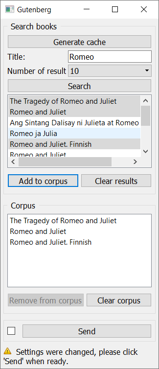

.. meta::
   :description: Orange3 Textable Prototypes documentation, Gutenberg
                 widget
   :keywords: Orange3, Textable, Prototypes, documentation, Gutenberg,
              widget

.. _Gutenberg:

Gutenberg
=============

Retrieve texts from gutenberg.org 

Author
------

Florian Rieder, Paul Zignani

Signals
-------

Input: None

Outputs:

* ``Text data``

    A segmentation with the selected texts.

Description
-----------

The widget is designed to import one or more texts from `<http://www.gutenberg.org/>`_ in Orange Canvas.
The output is a segmentation containing a segment for each imported text, annoted by title author and language.

Interface
~~~~~~~~~

.. _Gutenberg_fig1:

    Figure 1: **Gutenberg** widget interface.

The **Gutenberg** widget lets the user generate the cache of the 
`Gutenberg <http://www.gutenberg.org/>`_ database, and search it.

The **Generate Cache** button allows the user to generate the gutenberg cache.
This has to be done only at first launch or if the database has been updated. It can 
last about 5 to 10 minutes.

The **results** section allows the user to add or remove texts from
the search results.

The **corpus** section is the users "basket". He can add or remove texts from
his corpus in the **results** section.

The **Send** button triggers the emission of a segmentation to the output
connection(s). When selected, the **Send automatically** checkbox
disables the button and the widget attempts to automatically emit a
segmentation at every modification of its interface.

Caveat about searches
~~~~~~~~~~~~~~~~~~~~~

A search can be executed using one or more parameters. The only case it won't work
is if the *language* is set to `any` and the other parameters are empty. However it 
is possible to make a search only by language.

The aurhors are written as `name, first name` in the database. However writing `first name name`
should also work for most of the authors.

In general using only one keyword in the inputs should give the most results.

Messages
--------

Information
~~~~~~~~~~~

*<n> segments sent to output (<m> characters).*
    This confirms that the widget has operated properly.

*The cache is being generated. This can take up to 10mn.*
    This confirms that the cache is being generated. A message will appear 
    in the log once the cache is fully generated.

*The cache already exists.*
    Informs the user that he has already downloaded the cache.

Warnings
~~~~~~~~

*Cache must be generated before fisrt launch, it can take up to 10mn*
    Appears only if the cache dosen't exist. It hould appear only the first 
    time you create a gutenberg widget.

*Settings were changed, please click 'Send' when ready.*
    Settings have changed but the **Send automatically** checkbox
    has not been selected, so the user is prompted to click the **Send**
    button (or equivalently check the box) in order for computation and data
    emission to proceed.

*You didn't search anything*
    The user wants to make a search without changing the initial settings.

*Your corpus is empty, please add some texts first*
    The corpus is empty, so the user have to add some texts before sending.

Errors
~~~~~~

*An error occurred while building the cache.*
    An error has prevented the cache generation.

*An error occurred while interrogating the cache.*
    An error happend while searching the database.

*Couldn't download data from Gutenberg.*
    An error has prevented the widget from accessing the 
    Gutenberg database or retrieving the data.
