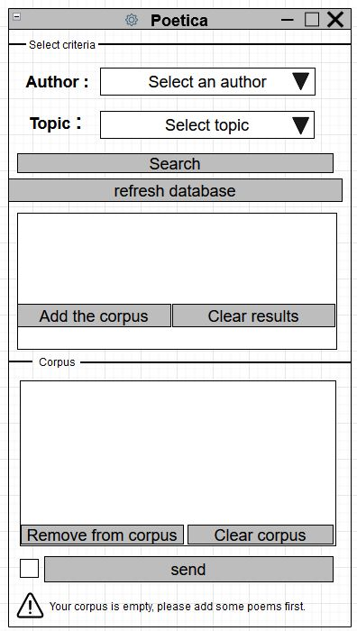

.. meta::
   :description: Orange3 Textable Prototypes documentation, Poetica
                 widget
   :keywords: Orange3, Textable, Prototypes, documentation, Poetica,
              widget

.. _Poetica:

Poetica
=============

A MODIFIER IMAGE CI-DESSUS

Make a corpus with selected poems.

Author
------

Sinem Kilic, Laure Margot, Leonie Nussbaum, Olivia Verbrugge

Signals
-------

Input: None

Outputs:

* ``Text data``

    A segmentation with the texts of the selected poems.

Description
-----------

This widget is designed to import one or more poems in Orange Canvas.
The poems are imported from the site `<https://poetica.fr/>`_. The output is a
segmentation containing a segment for each imported poem.
Each segment has different annotations with keys *Author*,
*Title*, *URL* and eventually *Topic*.

Interface
~~~~~~~~~

.. _Poetica_fig1:

    Figure 1: **Poetica** widget interface.

The **Poetica** widget allows the user to make a research on the Poetica's website (`<https://poetica.fr/>`_).

The **Select criterias** section allows the user to search poems by their author and/or topic.
He can add his favorite results to his basket.

* ``Author``

    List of authors from which the selection can be made.

* ``Topic``

    List of topics from which the selection can be made.

* ``Search``

    If an author and/or a topic has been selected, allow the research.

* ``Refresh database``

    Update the database of topics, authors and titles of the poems.
    This action may take some time. This is why a pop-up asks the user to confirm the update when the button has been clicked.

* ``Add to corpus``

    Add one ore more selected poems in the user's basket.

* ``Clear results``

    Clear the research results basket.

The **Corpus** section is the user's basket. There he can remove elements from his corpus or clear it completely.

* ``Remove from corpus``

    Remove one or more selected items from the user's basket.

* ``Clear corpus``

    Delete the whole user's basket

The **Send** button manages the emission of a segmentation to the output
connection(s). When selected, the **Send automatically** checkbox
disables the button and the widget attempts to automatically emit a
segmentation at every modification of its interface.

Messages
--------

Information
~~~~~~~~~~~

*<n> segment sent to output (<m> characters).*
    Confirms that the widget has operated properly.

Warnings
~~~~~~~~

*You add a poem*
    Informs that one or more poems have been added.

*Select a poem*
    Informs the user if he hasn't selected any poems to add.

*Your corpus is empty, please add some poems first*
    Informs the user if he wants to send his results but that his basket is empty.

*Settings were changed, please click 'Send' when ready.*
    Informs the user that the settings where changed. He can send his basket to have his new selection as output by clicking on the **Send** button.

Errors
~~~~~~

If the poem's URL isn't valid, an error message (*Invalid poem's URL*) is displayed in the shell.