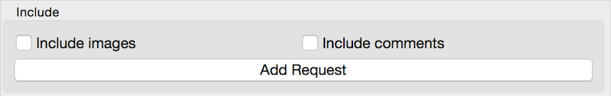

.. meta::
   :description: Orange3 Textable Prototypes documentation, Redditor widget
   :keywords: Orange3, Textable, Prototypes, documentation, Redditor, widget

.. _Redditor:

Redditor
========

    

Authors
--------

Loris Rimaz, Olivia Edelman, Nahuel Degonda

Signals
--------

Inputs: None

Outputs:

* ``Segmentation``

  Segmentation with segments for each post and comment in imported corpora

Description
------------

This widget is designed to scrap one or more different types of content from Reddit, data is retrieved from
`<https://www.reddit.com/>`. 
The widget outputs at least one segmentation with the title and content of a post or subreddit, with the possibility to include or exclude comments and images.
Segments in this segmentation have a number of annotations :

.. csv-table:: 
   :header: KEY, EXAMPLE VALUE
   :widths: 30, 30

   Author,     *cosmicnebula257*
      Id,      *bp1ze4*
      Parent,  *bp1ze4*
      Parent_type,  *0*
      Posted_Unix,  *1557946951.0*
      Posted_at,   *2009-5-15  19:02:31*
      Score,   *1*
      Title,   *Random invites while AFK in the menu*

Interface
----------

The **Redditor** widget lets the user select one or more posts or subreddits 
from the Reddit website`<https://www.reddit.com/>`. 

The **Subreddit** mode allows the user to scrap the data of an entire subreddit. Users can sort the subreddits by: 

- *Hot*
- *New*
- *Controversial*
- *Top* 
- *Rising*

Users can also choose the amount of posts they want to upload to the widget.

.. _subreddit_fig2:

    
    

The **Full Text** mode allows the user to upload/scrap from all of Reddit and not just specifically from a subreddit or a url.
The **Full Text** mode has three filters. 

1. The **Sort by** filter : *Relevance*, *Top*, *New*, *Comments*. 
2. The **Time** filter : *All*, *Past day*, *Past hour*, *Past month*, *Past hour*.
3. The **Amount of posts** filter, just like in the **Subreddit** mode.

.. _fullText_fig3:

The **URL** mode allows the user to search data by directly using the URL of a post or subreddit.

.. _url_fig4:

.. figure:: figures/url_fig4.png
    :align: center
    :scale: 15 %

The widget also has options available for all three modes.

The **Include Images** option allows the user to choose wether or not he wants to include the images of certain posts and/or subreddits.

The **Include Comments** option allows the user to choose wether or not he wants to include comments in his output.

.. _include_fig5:

The **Add Request** button allows users to add multiple posts and/or subreddits to the basket in the **Selection** box. To select multiple files use the **Selection** box to add them to the basket.

The **Send** button is used to send data to output.

When the widget gets closed and re-opened, the content of it is saved. To delete this saved content, the user has to reset the widget settings.

Messages
---------

Information
~~~~~~~~~~~

*<n> segments sent to output.*
    This confirms that the widget has operated properly.

Warnings
~~~~~~~~

*Settings were changed, please click 'Send' when ready.*
    Settings have changed but the **Send automatically** checkbox
    has not been selected, so the user is prompted to click the **Send**
    button (or equivalently check the box) in order for computation and data
    emission to proceed.

*The post found only contains images. Try to include images or comments.*
   The widget instance is unable to emit image to output because the user hasn't checked the box for images

*Please fill in the input box.*
   The widget instance is unable to emit data to output because the user hasn't filled in the input box.

Errors
~~~~~~

*Error in redirect, please make sure the subreddit name is correct.*
    An error has prevented the widget to download the data from Reddit, most likely because of a misspelling.

*Subreddit not found.*
    An error has prevented the widget to download the data from Reddit, the subreddit was not found, might not exist, might be a user mistake.

*No match for URL.*
    An error has prevented the widget to download the data from Reddit, the URL was not found, might not exist, might be a user mistake.

*URL not found.*
     An error has prevented the widget to download the data from Reddit, the input was not in URL format.
