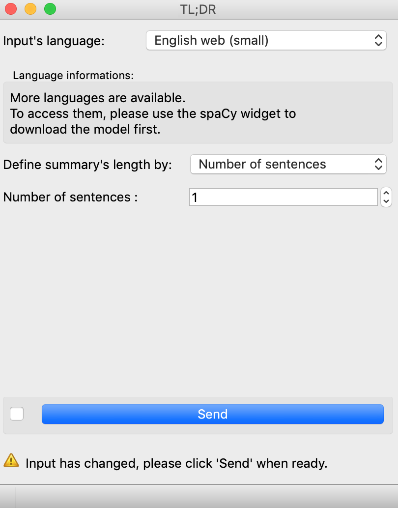
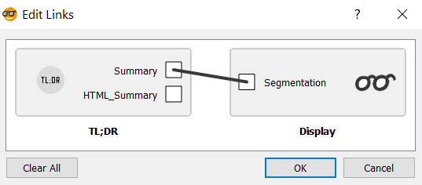

.. meta::
    :description: Orange3 Textable Prototypes documentation,  Text_Summarizer, widget, spaCy, Scikit-learn
    :keywords: Orange3, Textable, Prototypes, documentation, Text_Summarizer, widget, spaCy, Scikit-learn

.. _Text_Summarizer:

Text Summarizer
===============
    
.. image:: figures/TL;DR.png
    :scale: 10
    

Create summaries with Scikit-learn and Spacy to select the most important sentences of a segmentation.

    
Author
------

Jason Ola, Melinda Femminis, Catherine Pedroni

Signals
-------

Inputs:

* ``Text segmentation``

Outputs:

* ``Text segmentation`` (Summary)
* ``Text segmentation`` (HTML Summary)

Description
-----------

This widget is designed to summarize a text segmentation. It takes a text segmentation as an input and summarizes it.  
Supported languages are dutch, english, french, german, greek, italian, lithuanian, norwegian, portuguese and spanish. 
It allows the user to choose the length of the summary by defining either the total number of sentences or the percentage of the input's length. When a segmentation with multiple segment is given as the input, the percentage is estimated according to the shortest segment. All created summaries will have the same number of sentences.

The widget can take a single segment to summarize or a segmentation with more than one segment. In the later situation, the widget can summarize each segment individually or consider all segments as one text input.

This widget has two types of outputs, one being the summary in itself, the other being the text input with its most important sentences highlighted. The ouput can be changed in the link interface.

.. note:: When having several segments as input, please note that the segments must be in the same language to have an intelligible summary.

Interface
~~~~~~~~~

The **widget** interface displays : 

- A dropdown list of languages to choose from

*Only installed models will be in this list. To use a model that is not installed, it must be downloaded with the spaCy widget first.*

- A dropdown list to define how to chose the summary's length
- An input field in which the user can set the number of sentences of the summary **OR** an input field that lets the user choose the summary's in percentage of the input's length
- An option to summarize all segments as one or each segment separately 

*Only available if the input is a segmentation with multiple semgnets.*

The **link** interface lets the user choose which output to send, either the summary or the text with the most important sentences highlighted:

The **Info** section informs the user about the status of the widget and 
indicates the number of segments and characters in the output segmentation, or 
the reasons why no segmentation is emitted (no corpus selected, connection 
issues, etc.).

The **Send** button triggers the retrieval and emission of one or more 
segmentations to the output connection(s). When it is selected, the **Send 
automatically** checkbox disables the button and the widget attempts to 
automatically emit a segmentation at every modification of its interface.

How to summarize a segmentation
~~~~~~~~~~~~~~~~~~~~~~~~~~~~~~~

Altough there are already several existing extractive summarizer, like bert-summarizer or pysummarization and so on, we chose to do it ourselves by using spaCy and Scikit-learn.
You can find out more about our method in this `notebook <https://github.com/melindafemminis/orange3-textable-prototypes/blob/master/orangecontrib/textable_prototypes/widgets/summary.ipynb>`_

Messages
--------

Information
~~~~~~~~~~~

*<n> segment sent to output.*
    This confirms that the widget has operated properly.

Warnings
~~~~~~~~

*Settings were changed, please click 'Send' when ready.*
    Settings have changed but the **Send automatically** checkbox
    has not been selected, so the user is prompted to click the **Send**
    button (or equivalently check the box) in order for computation and data
    emission to proceed.

*Widget needs input.*
    A segment should be input in the widget.
    
*Please use the spaCy widget to download a language model first.*
    Warns user that a spaCy model must be installed and disable GUI.

