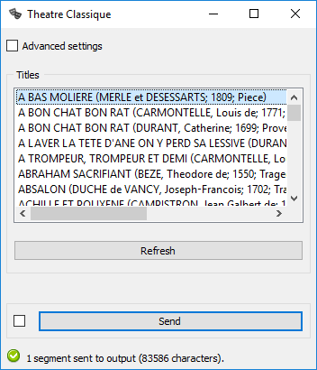

.. meta::
   :description: Orange3 Textable Prototypes documentation, Theatre Classique 
                 widget
   :keywords: Orange3, Textable, Prototypes, documentation, Theatre Classique,
              widget

.. _Theatre Classique:

Theatre Classique
=================

.. image:: figures/theatre_classique.png

Import theater plays from the `theatre-classique 
<http://www.theatre-classique.fr>`_ website (in TEI-XML).

Author
------

Aris Xanthos

Signals
-------

Inputs: None

Outputs:

* ``Text data``

  Segmentation covering the content of imported TEI-XML-encoded theatre plays

Description
-----------

This widget is designed to import one or more theatre plays in Orange Canvas.
The plays are retrieved from `<http://www.theatre-classique.fr>`_ and richly
encoded in TEI-XML format. The output is a segmentation containing a segment 
for each imported play. Each segment has 5 annotations with keys *author*, 
*title*, *year*, *genre*, and *url*.
  
The interface of **Theatre Classique** is available in two versions, according 
to whether or not the **Advanced Settings** checkbox is selected.

Basic interface
~~~~~~~~~~~~~~~

In its basic version (see :ref:`figure 1 <theatre_classique_fig1>` below), the 
**Theatre Classique** widget simply lets the user select one or more plays
in the catalogue of more than 800 entries downloadable from the 
`theatre-classique <http://www.theatre-classique.fr>`_ website. To select 
multiple files use either control/command-click or shift-click.

.. _theatre_classique_fig1:

    Figure 1: **Theatre Classique** widget (basic interface).

The **Options** section allows the user to define the label of the output
segmentation (**Output segmentation label**).

The **Info** section indicates the number of segments and characters in the 
output segmentation, or the reasons why no segmentation is emitted (no title 
selected, connection issues, etc.).

The **Send** button triggers the emission of a segmentation to the output
connection(s). When it is selected, the **Send automatically** checkbox
disables the button and the widget attempts to automatically emit a
segmentation at every modification of its interface.

Advanced interface
~~~~~~~~~~~~~~~~~~

The advanced version of **Theatre Classique**  (see :ref:`figure 2 
<theatre_classique_fig2>` below)offers the same functionality as
the basic one, and it adds the possibility of selecting only the plays of a
given author/genre/title.

.. _theatre_classique_fig2:

.. figure:: figures/theatre_classique_advanced_interface.png
    :align: center
    :alt: Advanced interface of the Theatre Classique widget
    
    Figure 2: **Theatre Classique** widget (advanced interface).

The **Options** and **Info** sections, as well as the **Send** button and 
**Send automatically**, operate in the same way as in the basic interface.

Messages
--------

Information
~~~~~~~~~~~

*<n> segments sent to output (<m> characters).*
    This confirms that the widget has operated properly.

Warnings
~~~~~~~~

*Settings were changed, please click 'Send' when ready.*
    Settings have changed but the **Send automatically** checkbox
    has not been selected, so the user is prompted to click the **Send**
    button (or equivalently check the box) in order for computation and data
    emission to proceed.

*Please select one or more titles.*
    The widget instance is not able to emit data to output because no theatre
    play has been selected.

    
Errors
~~~~~~

*Couldn't download data from theatre-classique website.*
    An error has prevented the widget to download the data from the 
    theatre-classique (most likely related to a connection problem).

