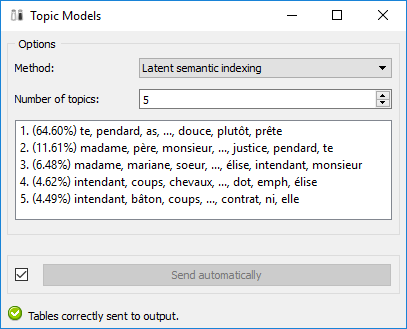

.. meta::
   :description: Orange3 Textable Prototypes documentation, Topic Models 
                 widget
   :keywords: Orange3, Textable, Prototypes, documentation, topic models,
              widget

.. _Topic Models:

Topic Models
============

Build topic models based on term-document matrices.

Author
------

Aris Xanthos

Signals
-------

Input:

* ``Textable crosstab``

    A term-document matrix in Textable PivotCrosstab format

Outputs:

* ``Term-topic Textable table``

    A table (in Textable PivotCrosstab format) showing the association between terms and topics

* ``Document-topic Textable table``

    A table (in Textable PivotCrosstab format) showing the association between documents and topics

* ``Term-topic Orange table``

    A table (in Orange format) showing the association between terms and topics

* ``Document-topic Orange table``

    A table (in Orange PivotCrosstab format) showing the association between documents and topics

Description
-----------

This widget takes a term-document matrix in input (such as emitted by 
Textable's **Count** widget) and applies one of several topic modelling methods
to these data in order to infer latent, fuzzy word and document categories. 

Two of the underlying methods (Latent Dirichlet and Latent semantic indexing
allocation) are based on the `Gensim <https://radimrehurek.com/gensim/>`_ 
third-party package  while the third method (correspondence analysis) uses 
Orange's internal implementation.

The widget's output are two pairs of tables (one in Textable format and one in 
Orange format): term-topic tables show how strongly each topic is associated to
each term, and document-topic tables displays their association with each 
document.

In addition, the widget's interface shows the list of terms that are most 
strongly associated with each topic. In the case of Latent semantic indexing 
and Correspondence analysis, the displayed terms are those that are 
either positively or negatively associated with each latent dimension
(or factor, or component), and an indication of the proportion of variance 
(or inertia) explained by each topic is also given (see 
:ref:`figure 1 <topic_models_fig1>` below).

Interface
~~~~~~~~~

The widget's interface requires little input from the user (see 
:ref:`figure 1 <topic_models_fig1>` below): the desired topic modelling 
**Method** (Latent Dirichlet allocation, Latent semantic indexing, or 
Correspondence analysis) and the **Number of topics** to be computed.

.. _topic_models_fig1:

    Figure 1: **Topic Models** widget interface.

The **Info** section indicates that the input has been correctly processed, or 
the reason why no output is emitted (no input, etc.).

The **Send** button triggers the computation and emission of term-topic and
document-topic tables to the output connection(s). When it is selected, the 
**Send automatically** checkbox disables the button and the widget attempts to 
automatically emit results at every modification of its interface.

Messages
--------

Information
~~~~~~~~~~~

*Tables correctly sent to output.*
    This confirms that the widget has operated properly.

Warnings
~~~~~~~~

*Settings were changed, please click 'Send' when ready.*
    Settings have changed but the **Send automatically** checkbox
    has not been selected, so the user is prompted to click the **Send**
    button (or equivalently check the box) in order for computation and data
    emission to proceed.

*Widget needs input*
    A term-document matrix (in Textable PivotCrosstab format) should be input
    in the widget.

    
