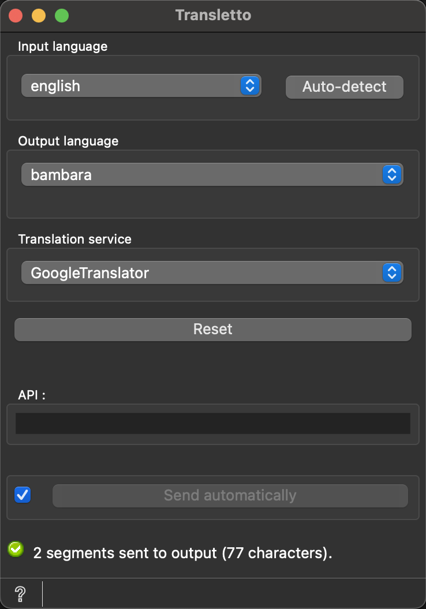

.. meta::
   :description: Orange3 Textable Prototypes documentation, Translate
                 widget
   :keywords: Orange3, Textable, Prototypes, documentation, Translate,
              widget

.. _Translate:

Translate
=========

.. image:: figures/Translate.svg

Translate a text using various translation APIs

Author
------

André da Glória Santiago, Sébastien Franzone, Marie Fasel, Klisman Kodra

Signals
-------

Input:

* ``Segmentation``

    A text segmentation to be translated.

Outputs:

* ``Translated data``

    A translated text segmentation.

Description
-----------

This widget takes a text segmentation as input and translates it into a specified target language using one of the available translation services. The translation services currently supported include GoogleTranslator, DeepL, and others as listed in the widget interface.

The widget's interface allows users to select the input language manually or enable automatic language detection. Users can also select the desired output language and choose the translation service to be used.

Interface
~~~~~~~~~

The widget's interface requires the following user inputs (see :ref:`figure 1 <translate_fig1>` below):

1. **Input language**: The language of the input text. This can be set manually or automatically detected.
2. **Output language**: The language into which the text will be translated.
3. **Translation service**: The service to be used for translation (e.g., GoogleTranslator, DeepL).
4. **Reset** button triggers the reset of the interface and puts the GoogleTranslator as a default translation service, and english as a default input and output language. 
5. **API**:In some instances, there is a need of an API key such as Deepl and QCRI.

.. _translate_fig1:

    Figure 1: **Translate** widget interface.

The **Info** section indicates that the input has been correctly processed or the reason why no output is emitted (e.g., no input, unsupported language).

The **Send** button triggers the translation and sends the translated text to the output connection. When the **Send automatically** checkbox is selected, the widget will attempt to automatically emit results whenever its interface is modified.

Messages
--------

Information
~~~~~~~~~~~

*Segments sent to output.*
    This confirms that the widget has operated properly and the translation is complete.

Warnings
~~~~~~~~

*Settings were changed, please click 'Send' when ready.*
    Settings have changed, but the **Send automatically** checkbox has not been selected, so the user is prompted to click the **Send** button (or check the box) to proceed with translation and data emission.

*Widget needs input*
    A text segmentation should be input into the widget for translation.

*An error occured*
    An error occurs when the translator cannot complete the translation. 

