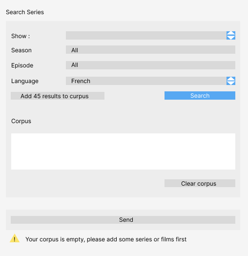

#################################
Specification Widget Addic7ed
#################################

1 Introduction
**************

1.1 But du projet
=================
Le but du projet est de créer un widget dans Orange Textable capable de récupérer des sous-titres de séries provenant du site addic7ed.com

1.2 Etapes du projet
====================
* Première version des spécifications: 23 mars 2023
* Remise des spécifications: 30 mars 2023
* Version alpha du projet: 27 avril 2023
* Version finale du projet: 1 juin 2023

1.3 Equipe et responsabilités
=============================
* Samantha Allendes (samantha.allendesbravo@unil.ch)
 - specification
 - documentation
 - interface
 - code 
 - tests 
 - Github
* Elijah Green (elijah.green@unil.ch)
 - specification
 - documentation
 - interface
 - code 
 - tests 
 - Github
* Thomas Rywalski (thomas.rywalski@unil.ch)
 - specification
 - documentation
 - interface
 - code 
 - tests 
 - Github
* Antoine Vigand (antoine.vigand@unil.ch)
 - specification
 - documentation
 - interface
 - code 
 - tests 
 - Github
 
2 Technique 
***********
 
2.1 Dépendances
===============
- Orange 3.24
- Orange Textable 3.1.8
- Addic7ed 16.03.2023
  
2.2 Fonctionnalités minimales
=============================
- Permettre à l'utilisateur de rechercher des sous-titres parmis une liste des 100 séries 
- Pouvoir faire une séléction de la saison ainsi que de l'épisode pour la recherche
- Sélectionner la langue dans laquelle l'utilisateur souhaite trouver les sous-titres
- Ajouter les résultats de la recherche au corpus

  
2.3 Fonctionnalités principales
===============================
- Ajouter la possibilité d'effacer le résultat de la recherche
- Pouvoir ajouter ou supprimer des éléments du corpus
- Avoir la possibilité d'envoyer automatiquement le corpus à l'output

 .. image:: images/Addic7ed_principal.png

2.4 Fonctionnalités optionnels
==========================
- Permettre à l'utilisateur de rechercher des sous-titres de n'importe quelle série

 .. image:: images/Addic7ed_optionnel.png

2.5 Tests
=========
TODO
  

3. Etapes
*********
  
3.1 Version Alpha
=================
* 27 avril 2023
  
3.2 Remise et présentation
===============
* 1er juin 2023
  
4 Infrastructures
*****************
Le projet est disponible sur GitHub à l'adresse https://github.com/Crohrb/orange3-textable-prototypes