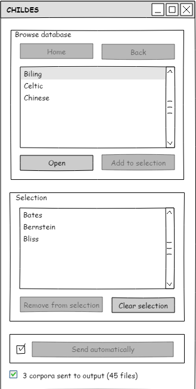

############################
Specification widget CHILDES
############################

1 Introduction
**************

1.1 But du projet
=================
Créer un widget pour Orange Textable (v3.1.0) permettant l'importation de corpus tirés de `la base de données CHILDES (en format XML) <https://childes.talkbank.org/data-xml/>`_

1.2 Aperçu des etapes
=====================
* Premiere version de la specification: 21 mars 2019
* Remise de la specification: 28 mars 2019
* Version alpha du projet:  2 mai 2019
* Remise et presentation du projet:  30 mai 2019

1.3 Equipe et responsabilitées
==============================

* Aris Xanthos (`aris.xanthos@unil.ch`_):

.. _aris.xanthos@unil.ch: mailto:aris.xanthos@unil.ch

    - specification
    - interface
    - code
    - documentation
    - tests

2. Technique
************

2.1 Dépendances
===============
* Orange 3.18
* Orange Textable 3.1.0
* requests
* BeautifulSoup

2.2 Fonctionnalités minimales
=============================

* permettre la navigation dans la base de données (à partir d'une version mise en cache) et la sélection d'un corpus.
* créer et émettre une segmentation avec un segment (=Input) pour le corpus importé.
* traitement correct des exceptions (HTTPError etc.)

2.3 Fonctionnalités principales
===============================

* permettre la navigation dans la base de données (à partir d'une version mise en cache).
* permettre de recréer le cache.
* permettre la constitution d'une sélection de corpus multiples (add/remove/clear).
* créer et émettre une segmentation avec un segment (=Input) pour chaque corpus importé.
* traitement correct des exceptions (HTTPError etc.)

2.4 Fonctionnalités optionnelles
================================
* créer et émettre une segmentation en énoncés.
* créer et émettre une segmentation en mots.

2.5 Tests
=========

TODO

3. Etapes
*********

3.1 Version alpha
=================
* L'interface graphique est complètement construite.
* Les fonctionnalités minimales sont prises en charge par le logiciel.

3.2 Remise et présentation
==========================
* Les fonctionnalités principales sont complétement prises en charge par le logiciel.
* La documentation du logiciel est complète.

4. Infrastructure
=================
Le projet est disponible sur GitHub à l'adresse `https://github.com/axanthos/Orange3TextablePrototypes.git
<https://github.com/axanthos/Orange3TextablePrototypes.git>`_
