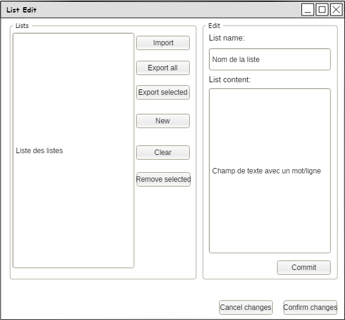

#################################
Specification widget LexicalHunter
#################################

1 Introduction
**************

1.1 But du projet
=================
Créer un widget pour Orange Textable permettant de détecter des champs lexicaux en fonction de listes de mots choisies par l'utilisateur.

1.2 Aperçu des étapes
=====================
* Premiere version de la specification: 15 mars 2018
* Remise de la specification: 22 mars 2018
* Version alpha du projet: 26 avril 2018
* Remise et presentation du projet:  24 mai 2018

1.3 Equipe et responsabilitées
==============================

* Simon Cappelle (`simon.cappelle@unil.ch`_):

.. _simon.cappelle@unil.ch: mailto:simon.cappelle@unil.ch

    - illustration
    - specification
    - code
    - documentation

* Maxime Bony (`maxime.bony@unil.ch`_):

.. _maxime.bony@unil.ch: mailto:maxime.bony@unil.ch

    - illustration
    - code
    - documentation
    - Verification ortographique

* Robin Pitteloud (`robin.pitteloud@unil.ch`_):

.. _robin.pitteloud@unil.ch: mailto:robin.pitteloud@unil.ch

    - illustration
    - code
    - documentation
    - debuggage
    - Verification ortographique

2. Technique
************

2.1 Dépendances
===============

* Orange 3.7 ou supérieur

* Orange Textable 3.0b0 ou supérieur

2.2 Fonctionnalités minimales
=============================

* Input : Un ou plusieurs segments

* Permettre le choix d'un ou plusieurs "champs lexicaux" parmis ceux proposés par défaut.

* Output : les segments d'entrée annotés avec une valeur de clé d'annotation choisie par l'utilisateur.

2.3 Fonctionnalités principales
===============================

* Fonctionnalités minimales

* Permettre d'importer, modifier et supprimer des listes de champs lexicaux.

2.4 Fonctionnalités optionnelles
================================

* Histogramme de la distribution des éléments

2.5 Tests
=========

Interaction du texte de sortie avec le widget segment de Textable.

3. Etapes
*********

3.1 Version alpha
=================
* L'interface graphique est complètement construite.
* Les fonctionnalités minimales sont prises en charge par le logiciel.

3.2 Remise et présentation
==========================
* Les fonctionnalités principales sont complétement prises en charge par le logiciel.
* La documentation du logiciel est complète.
* Le logiciel possède des routines de test de ses fonctionnalités (principales ou optionnelles).

4. Infrastructure
=================
Le projet est disponible sur GitHub à l'adresse `https://github.com/axanthos/TextablePrototypes.git
<https://github.com/axanthos/TextablePrototypes.git>`_
