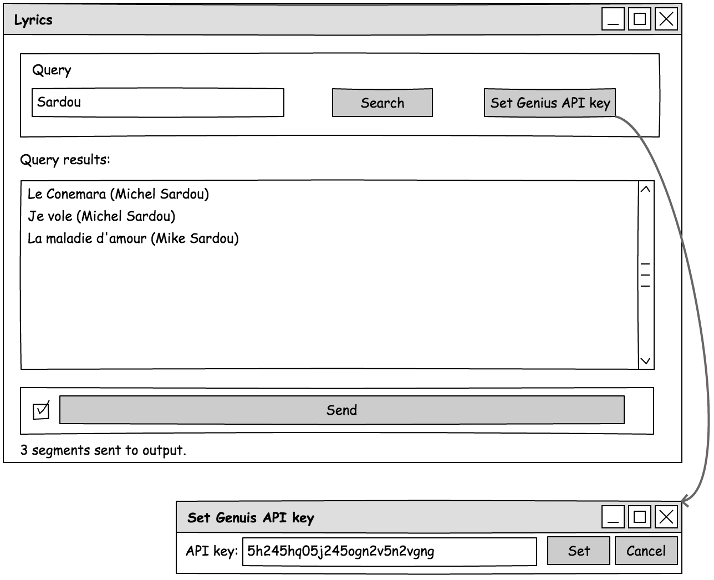
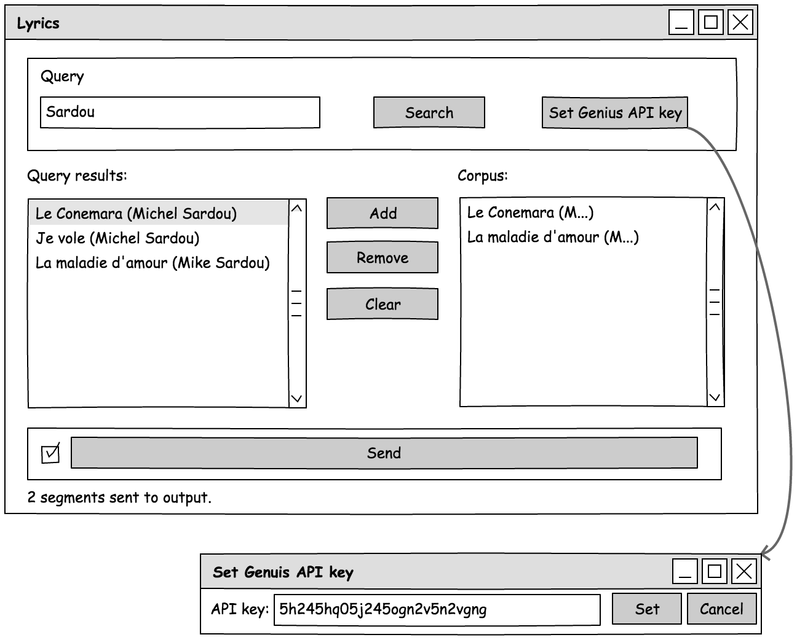

######################################
Specification widget Lyrics
######################################

1 Introduction
**************

1.1 But du projet
=================
Créer un widget pour Orange Textable (v3.7) permettant l'importation de paroles de chansons à partir de l'API `Genius
<https://genius.com>`_.

1.2 Aperçu des étapes
=====================
* Premiere version de la spécification: 15 mars 2018
* Remise de la specification: 22 mars 2018
* Version alpha du projet:  26 avril 2018
* Version finale du projet:  31 mai 2018

1.3 Equipe et responsabilitées
==============================

* Cyrille Gay Crosier:

  - spécification
  - code: Backend, module "recherche"
  - tests
  - github

* Basile Maillard:

  - code: Backend, module "gestion corpus"
  - tests
  - documentation
  - github

* Rafael Bruni Baschino:

  - spécification
  - interface
  - tests
  - github

2. Technique
************

2.1 Dépendances
===============
* Orange 3.7

* Orange Textable 3.1.0b3

2.2 Fonctionnalités minimales
=============================

* permettre le choix et l'importation de multiples chanson à partir des données du site Genius.

* créer et émettre une segmentation avec un segment (=Input) pour chaque chanson de la requête.

2.3 Fonctionnalités principales
===============================

* permettre le choix et l'importation de multiples chanson à partir des données du site Genius.

* créer et émettre une segmentation avec un segment (=Input) pour chaque chanson importée.

* ajouter, retirer et vider un corpus.

* traitement correct des exceptions (HTTPError etc.)

2.4 Fonctionnalités optionnelles
================================
* permettre une recherche par artiste

2.5 Tests
=========

TODO

3. Etapes
*********

3.1 Version alpha
=================
* L'interface graphique est complètement construite.

* Les fonctionnalités minimales sont prises en charge par le logiciel et ont été testées.

3.2 Remise et présentation
==========================
* Les fonctionnalités principales sont complétement prises en charge par le logiciel.

* La documentation du logiciel est complète.

* Les fonctionnalités principales (et, le cas échéant, optionnelles) sont implémentées et ont été testées.

4. Infrastructure
=================
Le projet est disponible sur GitHub à l'adresse `https://github.com/solliryc/orange3-textable-prototypes

<https://github.com/solliryc/orange3-textable-prototypest>`_
