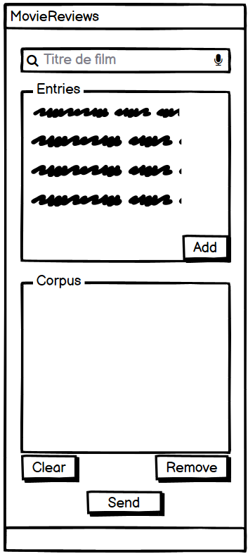

#################################
Specification Widget MovieReviews 
#################################

1 Introduction
**************

1.1 But du projet
=================
Le but du projet est de créer un widget dans Orange Textable capable de récupérer des critiques de films venant du film IMDB et de les renvoyer avec divers annotations.

1.2 Etapes du projet
====================
* Première version des spécifications: 25 mars 2021
* Remise des spécifications: 1er avril 2021
* Version alpha du projet: 29 avril 2021
* Version finale du projet: 3 juin 2021

1.3 Equipe et responsabilités
=============================
* Caroline Roxana Rohrbach (carolineroxana.rohrbach@unil.ch)
* Maryam Zoee (maryam.zoee@unil.ch)
* Victor Vermot-Petit-Outhenin (victor.vermot-petit-outhenin@unil.ch)
 - specification
 - code
 - documentation
 - tests
 - GitHub
 
2 Technique 
***********
 
2.1 Dépendances
===============
- Orange 3.24
- Orange Textable 3.1.8
- IMDbPY 2020.09.25
  
2.2 Fonctionnalités minimales
=============================
Permettre à l'utilisateur de rechercher n'importe quel film par titre et d'en retirer les 25 critiques les plus pertinentes. 

  
2.3 Fonctionnalités principales
===============================
- Ajouter de posiibilté de recherche pour les films:
 * Par acteur
 * Par genre

- Pouvoir ajouter et supprimer les films dans un corpus

- Importer les metadonnées liés au critiques de films

2.4 Fonctionnalités optionnels
==========================
- Trouver un moyenne pour obtenir plus de 25 critiques par film

2.5 Tests
=========
TODO
  

3. Etapes
*********
  
3.1 Version Alpha
=================
* L'interface graphique est complètement construite.
* Les fonctionnalités minimales sont prises en charge par le logiciel et ont été testées.
  
3.2 Remise et présentation
===============
* L'interface graphique est complètement construite.
* Les fonctionnalités principales sont complétement prises en charge par le logiciel.
* La documentation du logiciel est complète.
* Les fonctionnalités principales (et, le cas échéant, optionnelles) sont implémentées et ont été testées.
  
4 Infrastructures
*****************
Le projet est disponible sur GitHub à l'adresse https://github.com/Crohrb/orange3-textable-prototypes
