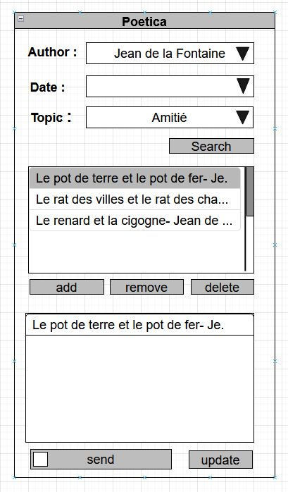

############################
Specification widget Poetica
############################

1 Introduction
**************

1.1 But du projet
=================

Créer un widget pour Orange Textable (v3.1.8) permettant de rechercher
des poèmes par le nom de leur auteur, leur année de publication ou par
différents thèmes.

Le site "Poetica" constitue notre source. C'est un site qui liste
différents poèmes francophones trié par auteurs et par thèmes.

1.2 Aperçu des étapes
=====================

* Première version des spécifications: 23 mars 2023
* Remise des spécifications: 30 mars 2023
* Version alpha du projet: 27 avril 2023
* Version finale du projet: 1er juin 2023

1.3 Equipe et responsabilités
==============================

* Olivia Verbrugge :
    - code
    - extraction des données
* Sinem Kilic :
    - maquette
    - code
* Leonie Nussbaum :
    - code
    - documentation
    - GitHub
* Laure Margot :
    - specification
    - code

2. Technique
************

2.1 Dépendances
===============

* Orange 3.30

* Orange Textable 3.1.8

* poetica *.*

2.2 Fonctionnalités minimales
===============================

* Permettre d'utiliser la recherche par auteur.

* Possibilité de séléctionner un poème dans une liste donnée et de l'ajouter à notre sélection.

* Supprimer un élément ou la liste complète dans notre sélection.

* Traitement correct des exceptions (HTTPError etc).

2.3 Fonctionnalités principales
===============================

* Première combobox : afficher la liste des auteurs établie par Poetica. Les auteurs sont triés par ordre alphabétique.

* Deuxième combobox : afficher la liste des dates établie par Poetica. Les dates sont triées par décénies, de manière croissante.

* Troisième combobox : afficher la liste des thèmes établie par Poetica. Les thèmes sont triés par ordre alphabétique.

* Bouton search permet de sortir tous les différents poèmes par auteur, date ou thème.

NB :
    * Si aucun champ n'est rempli, tous les poèmes sortent.
    * Si un champ est rempli, les poèmes sortis sont ceux correspoondant au champ rempli.
    * Si plusieurs champs sont remplis, la recherche est affinée et les poèmes sortent spécifiquement.

2.4 Fonctionnalités optionnelles
================================

* Mettre à jour les données extraites du site Poetica.

2.4 Tests
=========

TODO

3. Etapes
*********

3.1 Version alpha
=================

* L'interface graphique est terminée.

* Les fonctionnalités minimales sont utilisables et testées.

3.2 Remise et présentation
==========================

4. Infrastructure
=================

Le projet est disponible sur GitHub à l'adresse `https://github.com/leonienussbaum/orange3-textable-prototypes.git`
