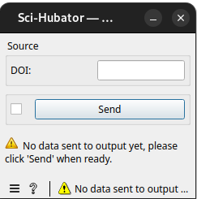
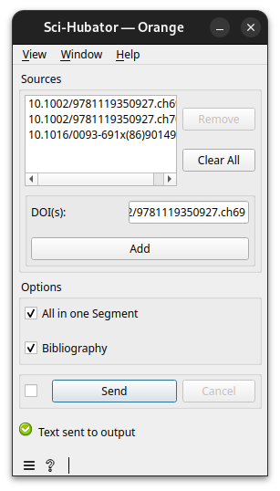

############################
Specification widget SCI-HUbator
############################

1 Introduction
**************

1.1 But du projet
=================
Créer un widget pour Orange Textable (v3.2.2) permettant l'importation et l'extraction de corpus tirés de `Sci-HUB <https://www.sci-hub.se/>`_

1.2 Aperçu des étapes
=====================
* Première version des spécifications: 13.03.2025
* Remise des spécifications: 20.03.2025
* Version alpha du projet: 17.04.2025
* Version finale du projet: 22.05.2025

1.3 Equipe et résponsabilités
==============================

* Luginbühl Colin (`colin.luginbuhl@unil.ch`_):

.. _colin.luginbuhl@unil.ch: mailto:colin.luginbuhl@unil.ch

    - Specification
    - Extraction des données
    - Code
    - Documentation

* Borgeaud Matthias (`matthias.borgeaud@unil.ch`_):

.. _matthias.borgeaud@unil.ch: mailto:matthias.borgeaud@unil.ch

    - Spécification
    - Code
    - Documentation
    - Vérification orthographe

* Peretti-Poix Sarah (`sarah.peretti-poix@unil.ch`_):

.. _sarah.peretti-poix@unil.ch: mailto:sarah.peretti-poix@unil.ch

    - Spécification
    - GitHub
    - Code
    - Débuggage

* Chétioui Orsowen (`orsowen.chetioui@unil.ch`_):

.. _orsowen.chetioui@unil.ch: mailto:orsowen.chetioui@unil.ch

    - Documentation
    - Code
    - Débuggage

2. Technique
************

2.1 Dépendances
===============
* Orange 3.38.1
* Orange Textable 3.2.2
* scihub.py
* PyMuPDF 1.25.4 (déjà présent pour SuperTextFiles)

2.2 Fonctionnalités minimales
=============================

* permettre l'importation de pdf tirés de SCI-HUB à l'aide d'un DOI et l'extraction du corpus textuel.
* créer et émettre une segmentation avec un segment (=Input) comprenant l'entièreté du texte du PDF.

2.3 Fonctionnalités principales
===============================

* permettre l'importation de pdf tirés de SCI-HUB (à partir d'un DOI).
* permettre d'en tirer le texte.
* permettre la constitution d'une sélection de corpus multiples (add/remove/clear).
* créer et émettre une segmentation avec un segment (=Input) pour chaque partie du corpus importé (résumé/abstract, bibliographie...).
* traitement correct des références

2.4 Fonctionnalités optionnelles
================================
* créer et émettre une segmentation par thème.
* créer et émettre un résumé/abstract.
* créer et émettre un tableau de cross-reference.
* importer un JSON contenant des nombreux liens

2.5 Tests
=========

TODO

3. Etapes
*********

3.1 Version alpha
=================
* L'interface graphique est complètement construite.
* Les fonctionnalités minimales sont prises en charge par le logiciel.

3.2 Remise et présentation
==========================
* Les fonctionnalités principales sont complétement prises en charge par le logiciel.
* La documentation du logiciel est complète.

4. Infrastructure
=================
Le projet est disponible sur GitHub à l'adresse `https://github.com/sarahperettipoix/orange3-textable-prototypes'
<https://github.com/sarahperettipoix/orange3-textable-prototypes>_
