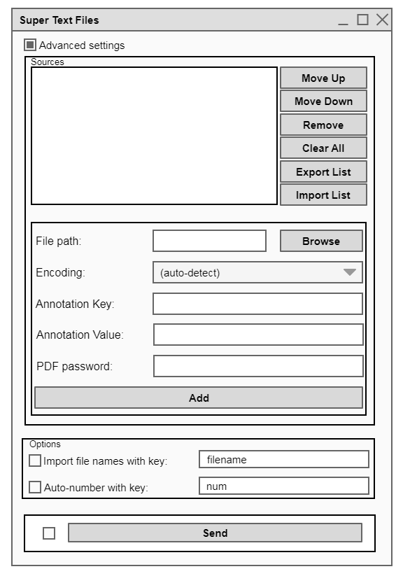

################################
Specification widget SuperTextFiles
################################

1 Introduction
**************

1.1 But du projet
=================
Créer un widget pour Orange Textable (v3.1.5) permettant d'extraire le contenu
textuel de fichiers PDF et d'images. 

1.2 Aperçu des etapes
=====================
* Premiere version de la specification: 26 mars 2020
* Remise de la specification: 02 avril 2020
* Version alpha du projet:  30 avril 2020
* Version finale du projet:  28 mai 2020

1.3 Equipe et responsabilitées
==============================

* Loïc Aubrays (`loic.aubrays@unil.ch`_):

.. _loic.aubrays@unil.ch: mailto:loic.aubrays@unil.ch

    - specification
    - code : interface
    - documentation
    - tests
    - GitHub

* Fabio Torres Cabral (`fabio.torrescabral@unil.ch`_):

.. _fabio.torrescabral@unil.ch: mailto:fabio.torrescabral@unil.ch

    - specification
    - maquette
    - code : scripts
    - documentation
    - tests

2. Technique
************

2.1 Dépendances
===============

* Orange 3.24.1

* Orange Textable 3.1.5

* `pdfplumber 0.5.19 <https://github.com/jsvine/pdfplumber>`_

* `Calamari OCR 1.0.5 <https://pypi.org/project/calamari-ocr/>`_

* `python-OpenCV` + `OpenCV <https://opencv.org/>`_

* `PyMuPDF 1.16.18 <https://pypi.org/project/PyMuPDF/>`_

2.2 Fonctionnalités minimales
=============================

* Permettre l'import de fichiers PDF contenant du texte

2.3 Fonctionnalités principales
===============================

* Permettre l'import de tous fichiers PDF ou images.
* Effectuer une reconnaissance optique des caractères d'une image ou d'un PDF
après sa conversion en image.

2.4 Fonctionnalités optionnelles
================================

* Permettre l'import de .doc, .docx, .odt ou .rtf
* Permettre d'importer des PDF protégés par mot de passe.

2.5 Tests
=========

TODO

3. Etapes
*********

3.1 Version alpha
=================
* L'interface graphique est complètement construite.
* Les fonctionnalités minimales sont prises en charge par le logiciel et ont été
testées.

3.2 Remise et présentation
==========================
* Les fonctionnalités principales sont complétement prises en charge par le logiciel.
* La documentation du logiciel est complète.
* Les fonctionnalités principales (et, le cas échéant, optionnelles) sont
implémentées et ont été testées.

4. Infrastructure
=================
Le projet est disponible sur GitHub à l'adresse `https://github.com/Aubrays/orange3-textable-prototypes
<https://github.com/Aubrays/orange3-textable-prototypes>`_

5.1 OCR
==========
* Compilation de ressources sur l'OCR : `Awesome OCR <https://github.com/kba/awesome-ocr>`_
