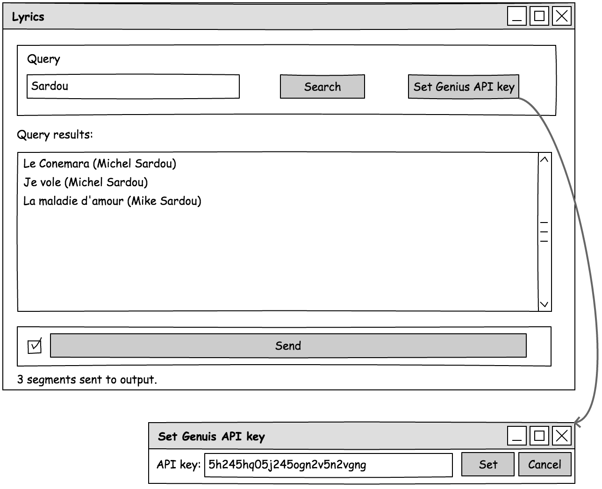
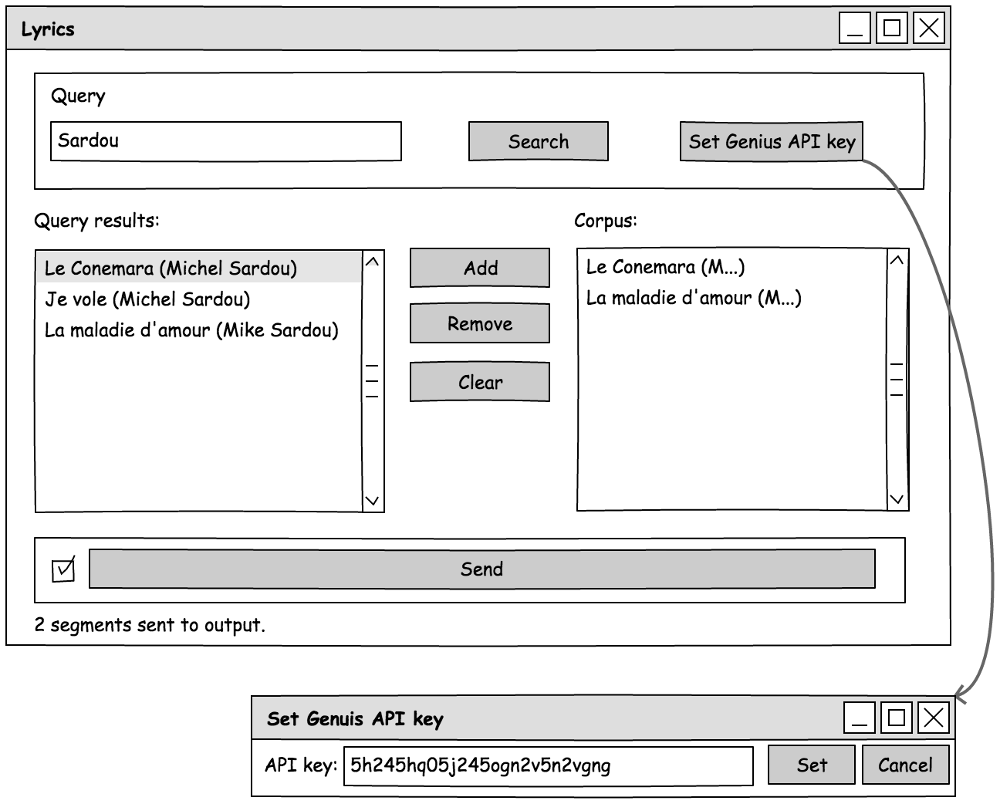

######################################
Specification widget SwissLaw
######################################

1 Introduction
**************

1.1 But du projet
=================
Créer un widget pour Orange Textable (v3.7) permettant l'importation des principaux textes de loi Suisse à partir de
fichier XML du site `fedlex.admin.ch <https://www.fedlex.admin.ch/fr/home?news_period=last_day&news_pageNb=1&news_order=
desc&news_itemsPerPage=10>`_. SwissLaw est un widget inclus dans Orange3-Textable-Prototypes, un outil développé avec
le logiciel Orange 3 en utilisant le langage Python.

1.2 Aperçu des étapes
=====================
* Premiere version de la spécification: 15 mars 2018
* Remise de la specification: 22 mars 2018
* Version alpha du projet:  27 avril 2023
* Version finale du projet:  1 juin 2023

1.3 Equipe et responsabilitées
==============================
* Mainteneur :
    - Aris Xanthos
    - Email : aris.xanthos@unil.ch
* Auteur(e)s :
    - Antoine Vigand :
    - Elijah Green :
    - Samantha Allendes Bravo :
    - Thomas Rywalski :

  - spécification
  - code: Backend, module "recherche"
  - tests
  - github

  - tests
  - documentation
  - github

  - code: Backend, module "gestion corpus"
  - spécification
  - interface
  - tests
  - github

2. Technique
************

2.1 Dépendances
===============
* Orange 3.35

* Orange Textable 3.1.11

2.2 Fonctionnalités minimales
=============================

* Télécharger les documents de loi suisse

* Segmenter les documents par Titre

* Télécharger les documents en français

* Ajouter, retirer les documents dans un panier

2.3 Fonctionnalités principales
===============================

* Télécharger les documents de loi suisse

* Segmenter les documents par Titre, Chapitre ou Article

* Télécharger les documents en français, italien ou allemand

* Ajouter, retirer les documents dans un panier

* Séléctionner les documents du panier qui nous intéressent

2.4 Fonctionnalités optionnelles
================================
* permettre une recherche par artiste

2.5 Tests
=========
TODO

2.6 Installation
============
Pour utiliser le widget SwissLaw, vous devez avoir Orange 3 et Orange3-Textable-Prototypes installés.
Suivez les instructions ci-dessous pour installer le widget :

1. Installez Orange 3 : `Guide d'installation Orange 3 <https://orangedatamining.com/download/#macos>`_
2. Installez Textable Prototypes : `Guide d'installation Textable Prototypes <https://pypi.org/project/Orange3-Textable-Prototypes/>`_

2.7 Utilisation
===========
1. Lancez Orange 3 et accéder à la section "Textable Prototypes".
2. Faites glisser et déposez le widget "Swiss Law" sur la zone de travail.
3. Configurez le widget en sélectionnant les options souhaitées.
4. Connectez le widget SwissLaw à d'autres widgets ou composants de votre flux de travail.
5. Exécutez le flux de travail pour accéder et analyser les documents de loi suisse.

3. Etapes
*********

3.1 Version alpha
=================
* L'interface graphique est complètement construite.

* Les fonctionnalités minimales sont prises en charge par le logiciel et ont été testées.

3.2 Remise et présentation
==========================
* Les fonctionnalités principales sont complétement prises en charge par le logiciel.

* La documentation du logiciel est complète.

* Les fonctionnalités principales (et, le cas échéant, optionnelles) sont implémentées.

4. Infrastructure
=================
Le projet est disponible sur GitHub à l'adresse `https://github.com/solliryc/orange3-textable-prototypes

<https://github.com/solliryc/orange3-textable-prototypest>`_