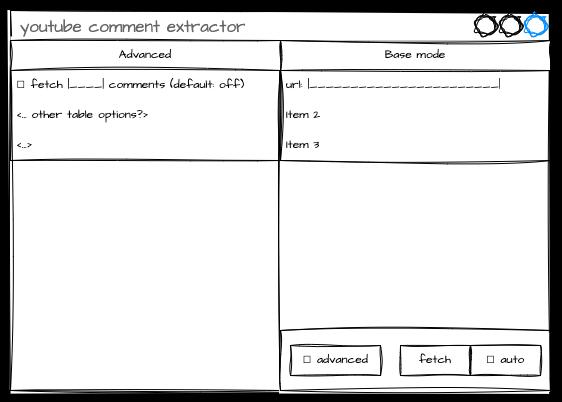

#################################
Specification widget YouGet
#################################

1 Introduction
**************

1.1 But du projet
=================
Créer un widget pour Orange Textable permettant de télécherager les commentaires d'un url YouTube.

1.2 Aperçu des étapes
=====================
* Premiere version de la specification: 13.03.2025
* Remise de la specification: 20.03.2025
* Version alpha du projet: 17.04.2025
* Remise et presentation du projet:  22.05.2025

1.3 Equipe et responsabilitées
==============================

* Virgile Albasini (`virgile.albasini@unil.ch`_):

.. _virgile.albasini@unil.ch: mailto:virgile.albasini@unil.ch

    	- code
	- design
	- specification

* Sophie Ward (`sophie.ward@unil.ch`_):

.. _sophie.ward@unil.ch: mailto:sophie.ward@unil.ch

	- code
	- design
	- specification

* Lorelei Chevroulet(`lorelei.chevroulet@unil.ch`_):

.. _lorelei.chevroulet@unil.ch: mailto:lorelei.chevroulet@unil.ch

   	- code
	- design
	- specification
	
* Vincent (`vincent@unil.ch`_):

.. _@unil.ch: mailto:@unil.ch

    	- code
	- design
	- specification

2. Technique
************

2.1 Dépendances
===============

* Orange 3.38.1 ou supérieur

* Orange Textable 3.2.2 ou supérieur

2.2 Fonctionnalités minimales
=============================

* Input : pas d'input

* Entrer une url pour télécharger les commentaires

* Output : les commentaires sous forme de segmentation

2.3 Fonctionnalités principales
===============================

* Fonctionnalités minimales

2.4 Fonctionnalités optionnelles
================================

* Peut choisir le nombre de commentaires en output

2.5 Tests
=========

Vérifier que les commentaires soient exportés

3. Etapes
*********

3.1 Version alpha
=================
* L'interface graphique est complétement construite.
* Le téléchargement des commentaires des vidéos YouTube sont fonctionnels.

3.2 Remise et présentation
==========================
* La documentation du logiciel est complète.
* Les fonctionnalités principales sont complétement prises en charge par le logiciel

4. Infrastructure
=================
Le projet est disponible sur GitHub à l'adresse `https://github.com/axanthos/TextablePrototypes.git
<https://github.com/axanthos/TextablePrototypes.git>`_
