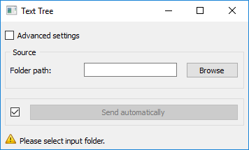
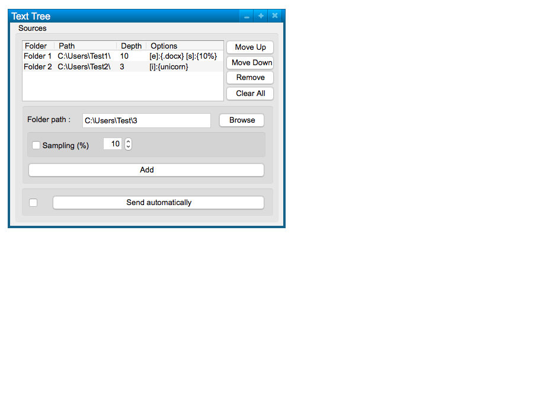
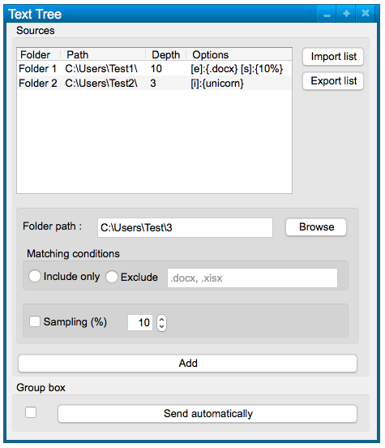

######################################
Spécification widget Arborescence
######################################

1 Introduction
**************

1.1 But du projet
=================
Créer un widget pour Orange Textable (v3.0b0) permettant d’importer une arborescence complète contenant des fichiers de texte.

1.2 Aperçu des étapes
=====================
* Première version de la specification: 16 mars 2017
* Remise de la spécification: 23 mars 2017
* Version alpha du projet:  27 avril 2017
* Remise et présentation du projet:  25 mai 2017

1.3 Équipe et responsabilités
==============================

* Olivier Cavaleri (`olivier.cavaleri@unil.ch`_):

.. _olivier.cavaleri@unil.ch: mailto:olivier.cavaleri@unil.ch

    - specification
    - interface
    - code

* Augustin Maillefer (`augustin.maillefer@unil.ch`_):

.. _augustin.maillefer@unil.ch: mailto:augustin.maillefer@unil.ch

    - code
    - documentation

* Mathieu Mercapide (`mathieu.mercapide@unil.ch`_):

.. _mathieu.mercapide@unil.ch: mailto:mathieu.mercapide@unil.ch

    - specification
    - code
    - documentation

2. Technique
************

2.1 Dépendances
===============

* Orange 3.3.12

* Orange Textable 3.0b0

2.2 Fonctionnalités minimales
=============================

* permettre le choix et l'importation de multiples fichiers en format texte (.txt, .xml, .html) dans une arborescence en encodage utf-8 (autres encodages ignorés en fonctionnalité minimale)

* créer et émettre une segmentation avec un segment pour chaque fichier importé et une annotation par niveau (max. 5) dans l'arborescence (dont une contenant tout le path)

2.3 Fonctionnalités principales
=============================

* permettre le choix et l'importation de multiples fichiers en format texte (.txt, .xml, .html) dans une arborescence.

* détection automatique de l'encoding (utf-8, iso 8859-1, etc...) puis tests des plus fréquents en cas d'erreur.

* traitement correct des exceptions (UnicodeEncodeError ou UnicodeDecodeError)

* affichage des répertoires ajoutés dans une liste avec leurs caractéristiques minimales (nom, path répertoire, profondeur maximum)

2.4 Fonctionnalités optionnelles
================================

* conditions d'inclusions [i] et exclusions [e] de fichiers et dossiers par leur nom.

* pouvoir spécifier un niveau de profondeur maximum de parcours de l'arborescence.

* échantillonage (x % sur tous les fichiers correspondant aux éventuelles conditions)

* affichage des répertoires ajoutés dans une liste avec leurs caractéristiques minimales et optionnelles (minimales : nom, path répertoire, profondeur maximum ; optionnelles : inclusions [i]:{conditions} / exclusions:{conditions} [e], échantillonage [s]:{pourcentage})

* importer ou exporter une liste de fichiers (avec leurs attributs)

2.5 Tests
=========

TODO

3. Étapes
*********

3.1 Version alpha
=================
* L'interface graphique est complètement construite.
* Les fonctionnalités minimales sont prises en charge par le logiciel.

3.2 Remise et présentation
==========================
* Les fonctionnalités principales sont complètement prises en charge par le logiciel.
* La documentation du logiciel est complète.
* Le logiciel possède des routines et fichiers de test de ses fonctionnalités (principales ou optionnelles)

4. Infrastructure
=================
Le projet est disponible sur GitHub à l'adresse `https://github.com/mmercapi/orange3-textable-prototypes.git
<https://github.com/mmercapi/orange3-textable-prototypes.git>`_
