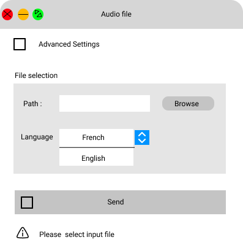
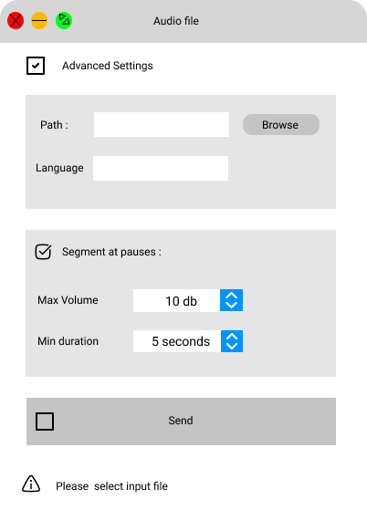

######################################
Spécification widget AudioFile
######################################

1 Introduction
**************

1.1 But du projet
=================
Créer un widget pour Orange Textable (v3.1.11) permettant d'importer un fichier audio, puis de le segmenter selon un volume spécifique.

1.2 Aperçu des étapes
=====================
* Première version de la specification: 24 mars 2022
* Remise de la spécification: 31 mars 2022
* Version alpha du projet:  28 avril 2022
* Remise et présentation du projet:  02 juin 2022

1.3 Équipe et responsabilités
==============================

* Johan Cuda (`johan.cuda@unil.ch`_):

.. _johan.cuda@unil.ch: mailto:johan.cuda@unil.ch

    - code : segmentation du fichier importé en fonction du volume pendant un certain temps

* Gavin Vinasi (`gavin.vinasi@unil.ch`_):

.. _gavin.vinasi@unil.ch: mailto:gavin.vinasi@unil.ch

    - maquette
    - interface

* Rebecca Kneubuehler (`rebecca.kneubuehler@unil.ch`_):

.. _rebecca.kneubuehler@unil.ch: mailto:rebecca.kneubuehler@unil.ch

    - specification
    - code : importation du fichier audio et retranscritpion en segmentation
    - fichier doc

2. Technique
************

2.1 Dépendances
===============

* Orange 3.31.0

* Orange Textable 3.1.11

* SpeechRecognition 3.8.1

* Pydub 0.25.1

2.2 Fonctionnalités minimales
=============================

* Permettre à l'utilisateur d'importer un fichier audio et de préciser avec quelle langue le fichier est utilisé

* Créer et émettre une segmentation classique du fichier audio ou une segmentation en fonction du volume

* Détection du format audio et convertissement vers le format wav pour les fichiers mp3

* Spécifier la langue dans laquelle l'audio est

2.3 Fonctionnalités principales
=============================

* Permettre l'importation d'un fichier audio en format wav ou mp3 

* Détection du format audio et convertissement vers le format wav pour les fichiers mp3

* Permettre le choix d'un volume audio maximum et du temps minimum de ce dit-volume selon lequel une segmentation se fait

2.4 Fonctionnalités optionnelles
================================

* Permettre la prise en charge d'autres langues que le français et l'anglais

2.5 Tests
=========

TODO

3. Étapes
*********

3.1 Version alpha
=================
*

3.2 Remise et présentation
==========================
* 

4. Infrastructure
=================
Le projet est disponible sur GitHub à l'adresse `https://github.com/mmercapi/orange3-textable-prototypes.git
<https://github.com/johancuda/orange3-textable-prototypes.git>`_

