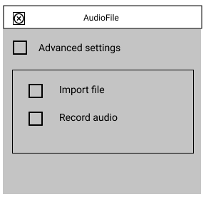
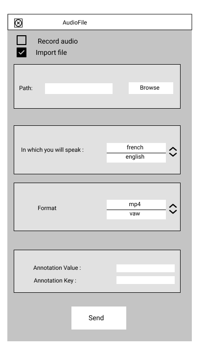
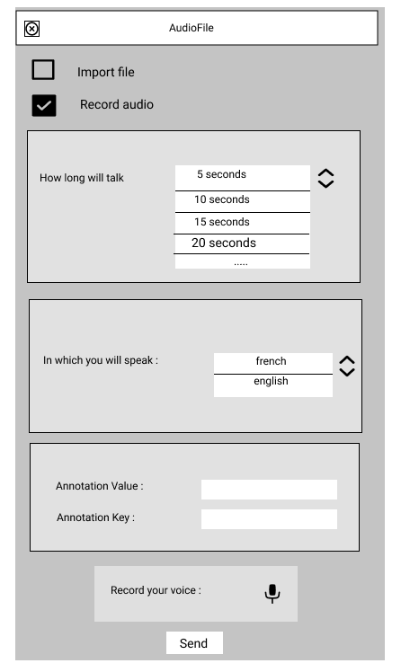

######################################
Spécification widget AudioFile
######################################

1 Introduction
**************

1.1 But du projet
=================
Créer un widget pour Orange Textable (v3.30.1) permettant d'importer ou d'enregistrer un fichier audio pour ensuite le retranscrire et/ou le segmenter en fichier texte

1.2 Aperçu des étapes
=====================
* Première version de la specification: 24 mars 2022
* Remise de la spécification: 31 mars 2022
* Version alpha du projet:  28 avril 2022
* Remise et présentation du projet:  02 juin 2022

1.3 Équipe et responsabilités
==============================

* Johan Cuda (`johan.cuda@unil.ch`_):

.. _johan.cuda@unil.ch: mailto:johan.cuda@unil.ch

    - code : segmentation du fichier importé en fonction du volume pendant un certain temps

* Gavin Vinasi (`gavin.vinasi@unil.ch`_):

.. _gavin.vinasi@unil.ch: mailto:gavin.vinasi@unil.ch

    - maquette
    - interface

* Rebecca Kneubuehler (`rebecca.kneubuehler@unil.ch`_):

.. _rebecca.kneubuehler@unil.ch: mailto:rebecca.kneubuehler@unil.ch

    - specification
    - code : importation du fichier audio et retranscritpion en segmentation
    - fichier doc

2. Technique
************

2.1 Dépendances
===============

* Orange 3.30.1

* Orange Textable 3.1.11

* Ajouter les packages ici (speech recognition, etc.)

2.2 Fonctionnalités minimales
=============================

* permettre le choix entre l'importation d'un fichier audio en format wav ou mp3 et entre l'enregistrement d'un fichier audio à partir du micro de l'utilisateur

* créer et émettre une segmentation du fichier audio

2.3 Fonctionnalités principales
=============================

* permettre l'importation d'un fichier audio en format wav ou mp3 

* détection du format audio et convertissement vers le format wav pour les fichiers mp3

* permettre l'enregistrement d'un fichier audio à partir du micro de l'utilisateur

* spécifier la durée de l'enregistrement audio 

* spécifier la langue dans laquelle l'audio est

* permettre l'ajout d'une annotation_key et d'une annotation_value

* permettre une segmentation en fonction du volume de l'audio lors d'une certaine durée

2.4 Fonctionnalités optionnelles
================================

* afficher une barre de chargement pour l'enregistrement audio

2.5 Tests
=========

TODO

3. Étapes
*********

3.1 Version alpha
=================
* L'interface graphique est complètement construite.
* Les fonctionnalités minimales sont prises en charge par le logiciel.

3.2 Remise et présentation
==========================
* Les fonctionnalités principales sont complètement prises en charge par le logiciel.
* La documentation du logiciel est complète.
* Le logiciel possède des routines et fichiers de test de ses fonctionnalités (principales ou optionnelles)

4. Infrastructure
=================
Le projet est disponible sur GitHub à l'adresse `https://github.com/mmercapi/orange3-textable-prototypes.git
<https://github.com/mmercapi/orange3-textable-prototypes.git>`_
