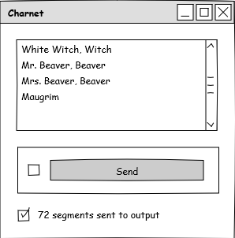
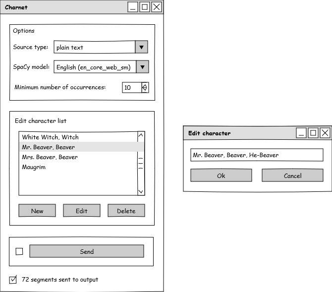

############################
Specification widget Charnet
############################

1 Introduction
**************

1.1 But du projet
=================

Créer un widget pour Orange Textable (v3.1.8) permettant d'appliquer à des
textes l'algorithme de création de réseau de personnages spécifié dans le module
Charnet.

1.2 Aperçu des etapes
=====================

* Première version des spécifications: 25 mars 2021
* Remise des spécifications: 1er avril 2021
* Version alpha du projet:  29 avril 2021
* Version finale du projet:  3 juin 2021

1.3 Equipe et responsabilités
==============================

* Aris Xanthos (`aris.xanthos@unil.ch`_):

.. _aris.xanthos@unil.ch: mailto:aris.xanthos@unil.ch

    - specification
    - interface
    - code
    - documentation
    - tests
    - GitHub

2. Technique
************

2.1 Dépendances
===============

* Orange 3.24

* Orange Textable 3.1.8

* spaCy 2.2

* charnet *.*

2.2 Fonctionnalités minimales
=============================

* Prendre une segmentation en entrée, la traiter comme un seul texte et lui appliquer l'algorithme par défaut de Charnet pour le texte brut (avec un modèle
spaCy prédéfini, p.ex. en_core_web_sm).

* Afficher la liste des personnages établie automatiquement par Charnet (NB: le premier élément de chaque ligne est considéré comme l'identifiant principal
du personnage).

* Créer et émettre une segmentation avec un segment correspondant à chaque  occurrence de personnage et une annotation pour son identifiant principal (clé
"id").

2.3 Fonctionnalités principales
===============================

* Prendre une segmentation en entrée, la traiter comme un seul texte et lui appliquer, au choix de l'utilisateur, l'algorithme de Charnet pour les scripts de films ou pour le texte brut.

* Dans le cas du texte brut, permettre à l'utilisateur de choisir un modèle spaCy parmi ceux installés sur la machine.

* Permettre à l'utilisateur de fixer le nombre minimum d'occurrences requis pour chaque personnage.

* Afficher la liste des personnages établie automatiquement par Charnet (NB: le premier élément de chaque ligne est considéré comme l'identifiant principal du personnage).

* Permettre à l'utilisateur d'éditer la liste en créant, modifiant ou supprimant une entrée (en validant si nécessaire les modifications avant application).

* Créer et émettre une segmentation avec un segment correspondant à chaque  occurrence de personnage et une annotation pour son identifiant principal (clé "id").

* Créer et émettre un réseau de personnages dans un format compatible avec les widgets de l'add-on "Networks" d'Orange Canvas.

2.4 Fonctionnalités optionnelles
================================

* Intégrer une visualisation de réseau directement dans le widget.

2.5 Tests
=========

TODO

3. Etapes
*********

3.1 Version alpha
=================

* L'interface graphique est complètement construite.
* Les fonctionnalités minimales sont prises en charge par le logiciel et ont été testées.

3.2 Remise et présentation
==========================

* Les fonctionnalités principales sont complétement prises en charge par le logiciel.
* La documentation du logiciel est complète.
* Les fonctionnalités principales (et, le cas échéant, optionnelles) sont implémentées et ont été testées.

4. Infrastructure
=================

Le projet est disponible sur GitHub à l'adresse `https://github.com/axanthos/orange3-textable-prototypes.git
<https://github.com/axanthos/orange3-textable-prototypes.git>`_
