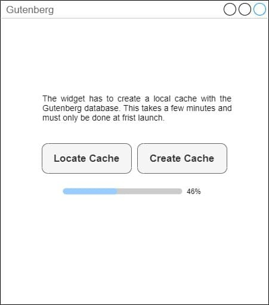
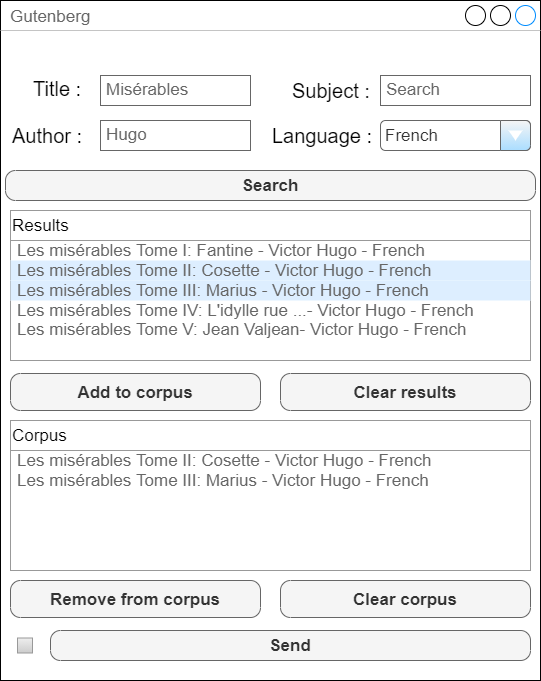

############################
Specification widget Charnet
############################

1 Introduction
**************

1.1 But du projet
=================

Créer un widget pour Orange Textable (v3.1.8) permettant d'importer directement des textes depuis la base de données Gutenberg.
L'utilisateur doit créer un cache de la base de données Gutenberg lors de la première utilisation. Ceci devrait prendre environ 5 minutes. Il a également la possibilité de rechercher un cache préexistant sur sa machine
Une fois le cache créé, l'utilisateur a accès à l'interface principale du widget.

1.2 Aperçu des etapes
=====================

* Première version des spécifications: 25 mars 2021
* Remise des spécifications: 1er avril 2021
* Version alpha du projet:  29 avril 2021
* Version finale du projet:  3 juin 2021

1.3 Equipe et responsabilités
==============================

* Florian Rieder (`florian.rieder@unil.ch`_):

.. _florian.rieder@unil.ch: mailto:florian.rieder@unil.ch

    - specification
    - code
    - documentation
    - tests
    - GitHub

* Paul Zignani (`paul.zignani@unil.ch`_):

.. _paul.zignani@unil.ch: mailto:paul.zignani@unil.ch

    - interface
    - code
    - documentation
    - tests
    - GitHub

2. Technique
************

2.1 Dépendances
===============

* Orange 3.24

* Orange Textable 3.1.8

* gutenbergpy

2.2 Fonctionnalités minimales
=============================

.. image:: images/gutenberg_minimal.png

* Générer le cache

* Chercher un livre par titre

* Créer et émettre une segmentation avec un segment correspondant à chaque  livre selectionné

2.3 Fonctionnalités principales
===============================

* Générer le cache et rechercher un cache préexistant

* Chercher des livres par auteur, titre, langue, sujet.

* Permettre à l'utilisateur de sélectionner plusieurs livres, provenant de plusieurs recherches différentes, en un corpus.

* Ajouter, retirer et vider un corpus.

* Créer et émettre une segmentation avec un segment correspondant à chaque  livre selectionné, avec en annotation les metadonnées du livre.

2.4 Fonctionnalités optionnelles
================================

* Permettre une recherche plus permissive

2.4 Tests
=========

TODO

3. Etapes
*********

3.1 Version alpha
=================

* L'interface graphique pour les fonctionnalités minimales est complètement construite.
* Les fonctionnalités minimales sont prises en charge par le logiciel et ont été testées.

3.2 Remise et présentation
==========================

* L'interface graphique est complètement construite.
* Les fonctionnalités principales sont complétement prises en charge par le logiciel.
* La documentation du logiciel est complète.
* Les fonctionnalités principales (et, le cas échéant, optionnelles) sont implémentées et ont été testées.

4. Infrastructure
=================

Le projet est disponible sur GitHub à l'adresse `https://github.com/axanthos/orange3-textable-prototypes.git
<https://github.com/axanthos/orange3-textable-prototypes.git>`_
