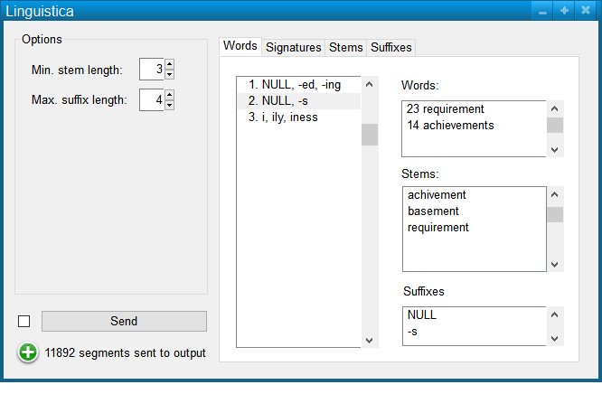

################################
Specification widget Linguistica
################################

1 Introduction
**************

1.1 But du projet
=================
Créer un widget pour Orange Textable (v3.1.0b3) permettant d'appliquer l'algorithme d'apprentissage non supervisé de la morphologie "Crab Nebula" de John Goldsmith à des données segmentées en mots.

1.2 Aperçu des etapes
=====================
* Premiere version de la specification: 15 mars 2018
* Remise de la specification: 22 mars 2018
* Version alpha du projet:  26 avril 2018
* Version finale du projet:  31 mai 2018

1.3 Equipe et responsabilitées
==============================

* Aris Xanthos (`aris.xanthos@unil.ch`_):

.. _aris.xanthos@unil.ch: mailto:aris.xanthos@unil.ch

    - specification
    - interface
    - code
    - documentation
    - tests
    - GitHub

2. Technique
************

2.1 Dépendances
===============

* Orange 3.7

* Orange Textable 3.1.0b3

2.2 Fonctionnalités minimales
=============================

.. image:: images/linguistica_minimal.png

* permettre la sélection des paramètres de longueur minimale des racines et longueur maximale des suffixes.

* créer et émettre une segmentation avec un segment correspondant à chaque segment entrant (=mot) et les annotations "stem", "suffix" et "signature" donnant respectivement la racine du mot, son suffixe et l'identifiant de la signature à laquelle il appartient.

* Si le mot appartient à plusieurs signatures, sélectionner la plus probable sur la base de la fréquence combinée de la racine et du suffixe en question.

2.3 Fonctionnalités principales
===============================

.. image:: images/linguistica_principal_words.png

* Permettre de visualiser et explorer la morphologie "apprise" par l'algorithme par le biais de deux onglets accessible dans la partie "mainarea" de l'interface.

* L'onglet "Words" affiche la liste des mots entrants et permet d'en sélectionner un pour afficher ses décompositions possibles en racine et suffixe; sélectionner une décomposition permet de voir la signature correspondante (identifiant, racines et suffixes).

* L'onglet "Signatures" affiche la liste des signatures et permet d'en sélectionner une pour afficher la liste des mots, racines et suffixes qui lui appartiennent.

2.4 Fonctionnalités optionnelles
================================

* Créer des onglets "stems" et "suffixes" pour explorer la morpholgie "apprise" sous l'angle de chacun de ces types d'unités.

2.5 Tests
=========

TODO

3. Etapes
*********

3.1 Version alpha
=================
* L'interface graphique est complètement construite.
* Les fonctionnalités minimales sont prises en charge par le logiciel et ont été testées.

3.2 Remise et présentation
==========================
* Les fonctionnalités principales sont complétement prises en charge par le logiciel.
* La documentation du logiciel est complète.
* Les fonctionnalités principales (et, le cas échéant, optionnelles) sont implémentées et ont été testées.

4. Infrastructure
=================
Le projet est disponible sur GitHub à l'adresse `https://github.com/axanthos/TextablePrototypes.git
<https://github.com/axanthos/TextablePrototypes.git>`_
