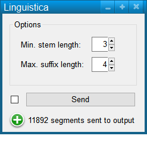
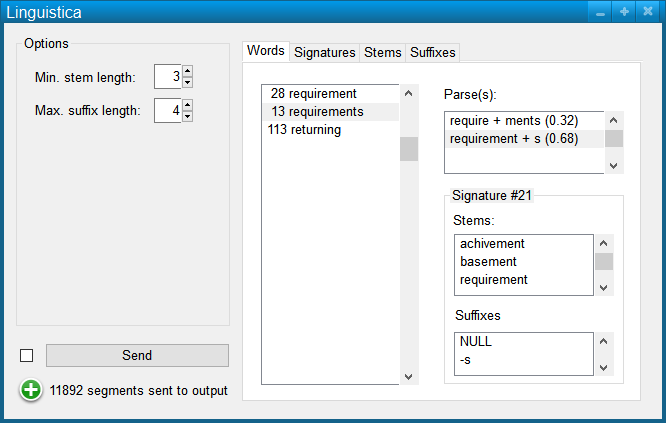
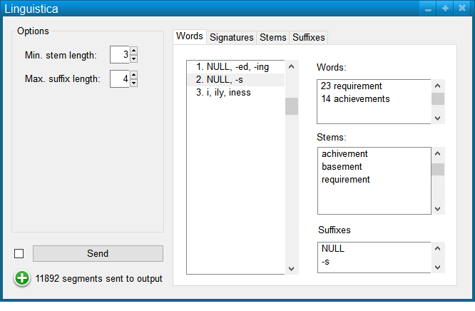

################################
Specification widget spaCy
################################

1 Introduction
**************

1.1 But du projet
=================
Créer un widget pour Orange Textable (v3.1.5) permettant d'appliquer les algorithmes de segmentation et d'analyse linguistique de la librairie spaCy.

1.2 Aperçu des etapes
=====================
* Premiere version de la specification: 26 mars 2020
* Remise de la specification: 2 avril 2020
* Version alpha du projet:  30 avril 2020
* Version finale du projet:  28 mai 2020

1.3 Equipe et responsabilitées
==============================

* Aris Xanthos (`aris.xanthos@unil.ch`_):

.. _aris.xanthos@unil.ch: mailto:aris.xanthos@unil.ch

    - specification
    - interface
    - code
    - documentation
    - tests
    - GitHub

2. Technique
************

2.1 Dépendances
===============

* Orange 3.24.1

* Orange Textable 3.1.5

* spaCy 2.2

**TODO images à mettre à jour**

2.2 Fonctionnalités minimales
=============================

* Permettre la sélection d'un modèle.

* Créer et émettre une segmentation avec un segment correspondant à chaque token identifié par spaCy et un nombre variable d'annotations pour chaque segment (selon les attributs rendus disponible par le modèle sélectionné le choix d'attributs).

2.3 Fonctionnalités principales
===============================

* Permettre le téléchargement et l'installation de nouveaux modèles. 

* Permettre le choix des attributs/annotations à créer pour chaque token

* Sur demande, créer et émettre d'autres niveaux de segmentation (entités nommées, phrases, "chunks")

2.4 Fonctionnalités optionnelles
================================

* Intégrer les visualisations offertes par spaCy (dépendances, entités) dans l'interface.

2.5 Tests
=========

TODO

3. Etapes
*********

3.1 Version alpha
=================
* L'interface graphique est complètement construite.
* Les fonctionnalités minimales sont prises en charge par le logiciel et ont été testées.

3.2 Remise et présentation
==========================
* Les fonctionnalités principales sont complétement prises en charge par le logiciel.
* La documentation du logiciel est complète.
* Les fonctionnalités principales (et, le cas échéant, optionnelles) sont implémentées et ont été testées.

4. Infrastructure
=================
Le projet est disponible sur GitHub à l'adresse `https://github.com/axanthos/orange3-textable-prototypes.git
<https://github.com/axanthos/orange3-textable-prototypes.git>`_
