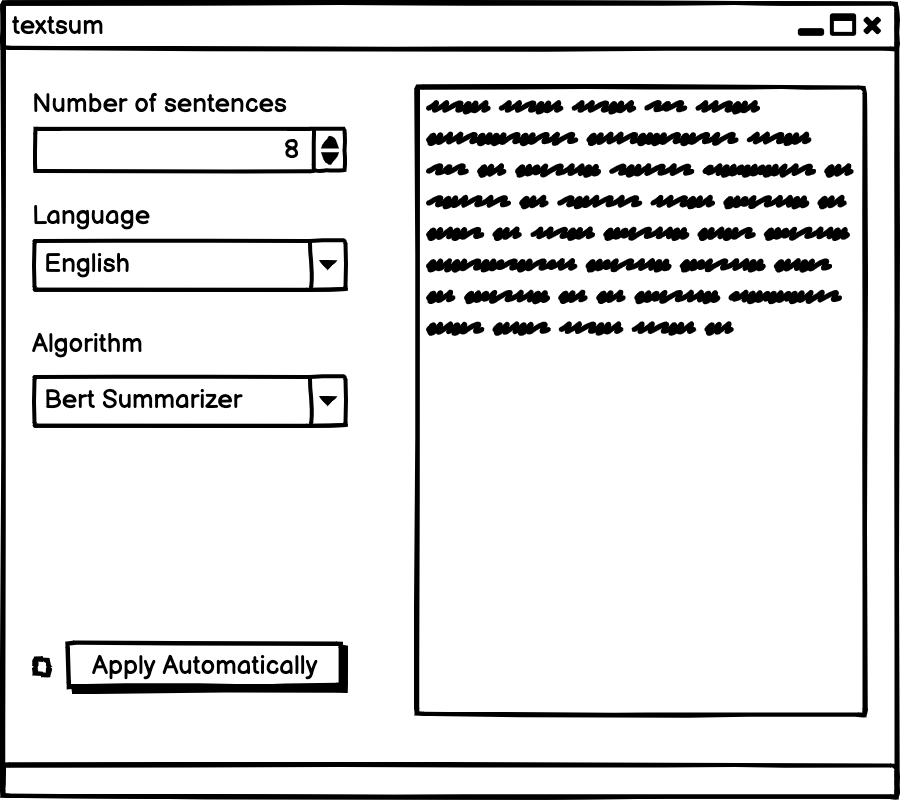

=============================
Spécifications du widget Text Summarizer
=============================

1. Introduction
===============

1.1 But du projet
---------------
Créer un widget pour Orange Textable (v3.1.8) permettant de résumer un ou plusieurs textes.

1.2 Aperçu des étapes
---------------
- Première version des spécifications: 25 mars 2021
- Remise des spécifications: 1er avril 2021
- Version alpha du projet: 29 avril 2021
- Version finale du projet: 3 juin 2021

1.3 Equipe et responsabilités
---------------
- Melinda Femminis

.. 

    - code
    - spécifications
    - tests
    - Github
    - Interface
    - documentation
    
    
- Jason Ola

.. 

    - code
    - Github
    - tests
    - documentation
    - spécifications
    - interface
    
- Catherine Pedroni

.. 

    - interface
    - spécification
    - documentation
    - tests
    - Github
    - code
    

2. Technique
=============

2.1 Dépendances
---------------
- Orange 3.24
- Orange Textable 3.1.8
- spaCy 3.0.5
- Scikit-learn 0.24.1

Il faut télécharger les modèle spaCy de chaque langue: 
    Anglais: `$ python -m spacy download en_core_web_sm`
    Français: `$ python -m spacy download fr_core_web_sm``
    Portugais: `$ python -m spacy download pt_core_web_sm`

2.2 Fonctionnalités minimales
-----------------------------

- Prendre une segmentation en entrée et proposer 2 possiblités:
    1. résumer la segmentation comme un seul texte
    2. résumer chaque segement séparément 
- Avoir le choix du nombre de phrases que le résumé doit contenir
- Pouvoir choisir la langue désirée entre anglais, français ou portugais

2.3 Fonctionnalités principales
-------------------------------

- Prendre une segmentation en entrée et proposer 2 possiblités:
    1. résumer la segmentation comme un seul texte
    2. résumer chaque segement séparément 
- Avoir le choix du nombre de phrases que le résumé doit contenir
- Choisir la longeur du résumé en pourcentage du texte principal
- Pouvoir choisir la langue désirée entre anglais, français ou portugais
- Visualisation des mots les plus importants en nuage de mots

2.4 Fonctionnalités optionnelles
--------------------------------
- Proposer différents algorithmes de résumé

3. Etapes
==========
3.1 Version alpha
---------------

- L'interface graphique pour les fonctionnalités minimales est complètement construite.
- Les fonctionnalités minimales sont prises en charge par le logiciel et ont été testées.

3.2 Remise et présentation
---------------

- L'interface graphique est complètement construite.
- Les fonctionnalités principales sont complétement prises en charge par le logiciel.
- La documentation du logiciel est complète.
- Les fonctionnalités principales (et, le cas échéant, optionnelles) sont implémentées et ont été testées.

4. Maquette
============

5. Infrastructure
==================

Le projet est disponible sur GitHub à l'adresse https://github.com/axanthos/orange3-textable-prototypes.git
