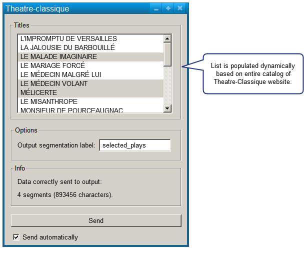
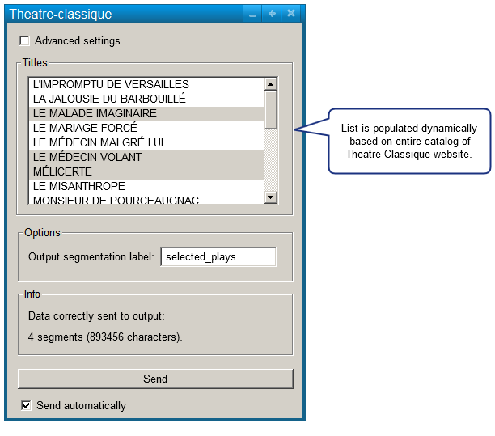
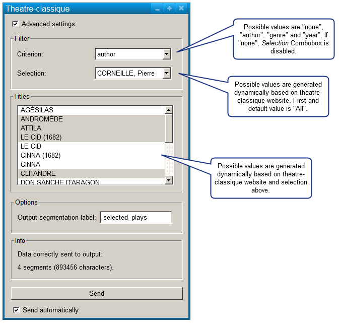

######################################
Specification widget Theatre-Classique
######################################

1 Introduction
**************

1.1 But du projet
=================
Créer un widget pour Orange Textable (v1.5.2) permettant l'importation de pièces de théâtre en format XML-TEI à partir du site `Théâtre-Classique
<http://www.theatre-classique.fr>`_.

1.2 Aperçu des etapes
=====================
* Premiere version de la specification: 17 mars 2016
* Remise de la specification: 24 mars 2016
* Version alpha du projet:  28 avril 2016
* Remise et presentation du projet:  26 mai 2016

1.3 Equipe et responsabilitées
==============================

* Aris Xanthos (`aris.xanthos@unil.ch`_):

.. _aris.xanthos@unil.ch: mailto:aris.xanthos@unil.ch

    - specification
    - interface
    - code
    - documentation

* Mattia Egloff (`mattia.Egloff@unil.ch`_):

.. _mattia.Egloff@unil.ch: mailto:mattia.Egloff@unil.ch

    - specification
    - tests
    - GitHub

2. Technique
************

2.1 Dépendances
===============

* Orange 2.7

* Orange Textable 1.5.2

2.2 Fonctionnalités minimales
=============================

* permettre le choix et l'importation de multiples titres en format XML-TEI à partir des données du site Théâtre-Classique.

* créer et émettre une segmentation avec un segment (=Input) pour chaque pièce importée.

2.3 Fonctionnalités principales
===============================

* permettre le choix et l'importation de multiples titres en format XML-TEI à partir des données du site Théâtre-Classique.

* créer et émettre une segmentation avec un segment (=Input) pour chaque pièce importée et des annotations *author*, *year* etc.

* choix possible du mode Advanced settings

* en mode Advanced settings, possibilité de sélectionner un critère de filtrage de la liste des titres (cf. image ci-dessus).

* traitement correct des exceptions (HTTPError etc.)

2.4 Fonctionnalités optionnelles
================================

* combinaison de plusieurs critères de filtrage

* filtrages plus complexes (p.ex. regex sur auteurs, intervalles d'années, etc.)

2.5 Tests
=========

TODO

3. Etapes
*********

3.1 Version alpha
=================
* L'interface graphique est complètement construite.
* Les fonctionnalités minimales sont prises en charge par le logiciel.

3.2 Remise et présentation
==========================
* Les fonctionnalités principales sont complétement prises en charge par le logiciel.
* La documentation du logiciel est complète.
* Le logiciel possède des routines de test de ses fonctionnalités (principales ou optionnelles.

4. Infrastructure
=================
Le projet est disponible sur GitHub à l'adresse `https://github.com/axanthos/TextablePrototypes.git
<https://github.com/axanthos/TextablePrototypes.git>`_
