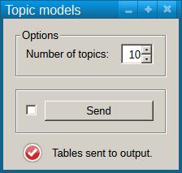
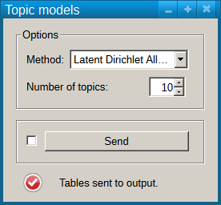

#################################
Specification widget Topic models
#################################

1 Introduction
**************

1.1 But du projet
=================
Créer un widget pour Orange Textable (v3.0b0) permettant l'application de techniques de topic modelling à des matrices documents--termes.

1.2 Aperçu des étapes
=====================
* Premiere version de la specification: 16 mars 2016
* Remise de la specification: 23 mars 2016
* Version alpha du projet: 27 avril 2016
* Remise et presentation du projet:  25 mai 2016

1.3 Equipe et responsabilitées
==============================

* Aris Xanthos (`aris.xanthos@unil.ch`_):

.. _aris.xanthos@unil.ch: mailto:aris.xanthos@unil.ch

    - specification
    - interface
    - code
    - documentation
    - préparation du café
    - consommation du café

2. Technique
************

2.1 Dépendances
===============

* Orange 3.4

* Orange Textable 3.0b0

* gensim 0.13.4 (ou 1.0.1 si compatible avec Python 3.4?)

2.2 Fonctionnalités minimales
=============================

* permettre le choix du nombre de topics.

* appliquer la méthode LSI et envoyer en output les tableaux topics--documents et topics--mots.

2.3 Fonctionnalités principales
===============================

* permettre le choix de la méthode (LSI ou LDA).

2.4 Fonctionnalités optionnelles
================================

* Ajouter une zone pour visualiser les associations topics-mots

* Ajouter des réglages avancés pour les paramètres LDA (*eta*, etc.)

2.5 Tests
=========

Fonctions de test des résultats des matrices générées pour un corpus d'exemple.

3. Etapes
*********

3.1 Version alpha
=================
* L'interface graphique est complètement construite.
* Les fonctionnalités minimales sont prises en charge par le logiciel.

3.2 Remise et présentation
==========================
* Les fonctionnalités principales sont complétement prises en charge par le logiciel.
* La documentation du logiciel est complète.
* Le logiciel possède des routines de test de ses fonctionnalités (principales ou optionnelles).

4. Infrastructure
=================
Le projet est disponible sur GitHub à l'adresse `https://github.com/axanthos/TextablePrototypes.git
<https://github.com/axanthos/TextablePrototypes.git>`_
