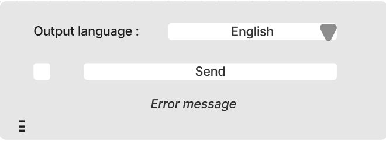

######################################
Specification widget Translate
######################################

1 Introduction
**************

1.1 But du projet
=================
Créer un widget pour Orange Textable (v3.35) permettant la traduction d'un texte donné. Translate est un widget inclus dans Orange3-Textable-Prototypes, un outil développé avec
le logiciel Orange 3 en utilisant le langage Python et la librairie deep-translator.

1.2 Aperçu des étapes
=====================
* Première version des spécifications: 21.03.2024
* Remise des spécifications: 28.03.2024
* Version alpha du projet: 25.04.2024
* Version finale du projet: 30.05.2024

1.3 Equipe et responsabilitées
==============================
* Mainteneur :
    - Aris Xanthos (aris.xanthos@unil.ch)

* Sébastien Franzone (sebastien.franzone@unil.ch)
 - specification
 - design interface
 - code interface
 
* André Da Glória Santiago (andre.dagloriasantiago@unil.ch)
 - specification
 - design interface
 - architecture

* Klisman Kodra (klisman.kodra@unil.ch)
 - specification
 - design interface
 - code interface

* Marie Fasel (marie.fasel@unil.ch)
 - specification
 - design interface
 - code interface

2. Technique
************

2.1 Dépendances
===============
* Orange 3.35

* Orange Textable 3.1.11

* Deep-translator 1.11.4

2.2 Fonctionnalités minimales
=============================

* Utilisation par défaut du service de traduction Mymemory Translator
* Détection automatique de la langue d'entrée
* Choix de la langue de sortie parmi les langues proposées par le service
* Envoi du texte traduit en sortie

2.3 Fonctionnalités principales
===============================

 .. image:: images/translate_principal.png

* Détection et sélection automatique de la langue d'entrée par défaut 
* Choix de la langue d'entrée si la détection automatique ne satisfait pas l'utilisateur
* Choix de la langue de sortie
* Choix du service de traduction parmi les services qui traitent la paire de langues sélectionnées
* Entrer la clé API si nécessaire
* Envoi du texte traduit en sortie sous la même structure qu'en entrée
* Dans le cas d'une segmentation multilingue en entrée, la détection automatique se base sur le premier segment et traite le reste de manière similaire

2.4 Fonctionnalités optionnelles
================================
* Afficher dans l'interface le nombre de caractères maximum pris en charge par le service choisi
* Découper le texte d'entrée en unités plus petites pour pallier au problème du nombre de caractères maximal par requête
* Fiche explicative qui introduit les services proposés
* Proposer d'autres services de traduction
* Régler le problème de la segmentation multilingue

2.5 Tests
=========
TODO

3. Etapes
*********

3.1 Version alpha
=================
* L'interface graphique est complétement construite.

* Les fonctionnalités du MVP sont implémentées.

3.2 Remise et présentation
==========================
* Les fonctionnalités principales sont complètement prises en charge par le logiciel.

* La documentation du logiciel est complète.

4. Infrastructure
*****************
Le projet est disponible sur GitHub avec le lien suivant
